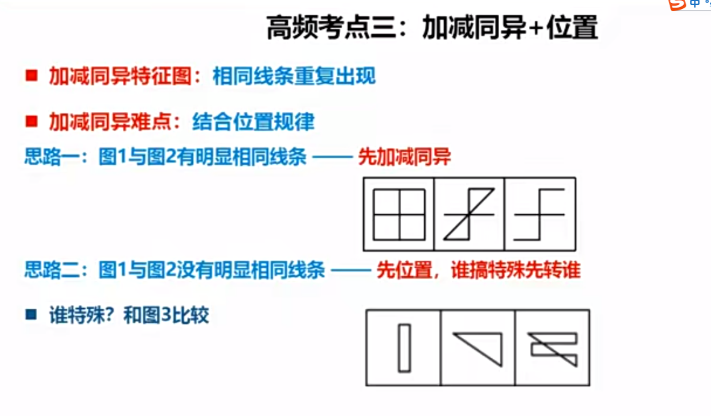
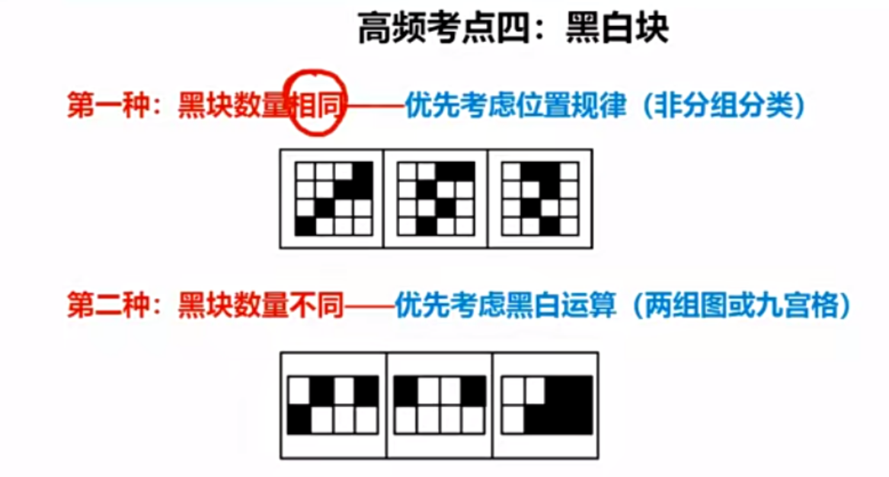
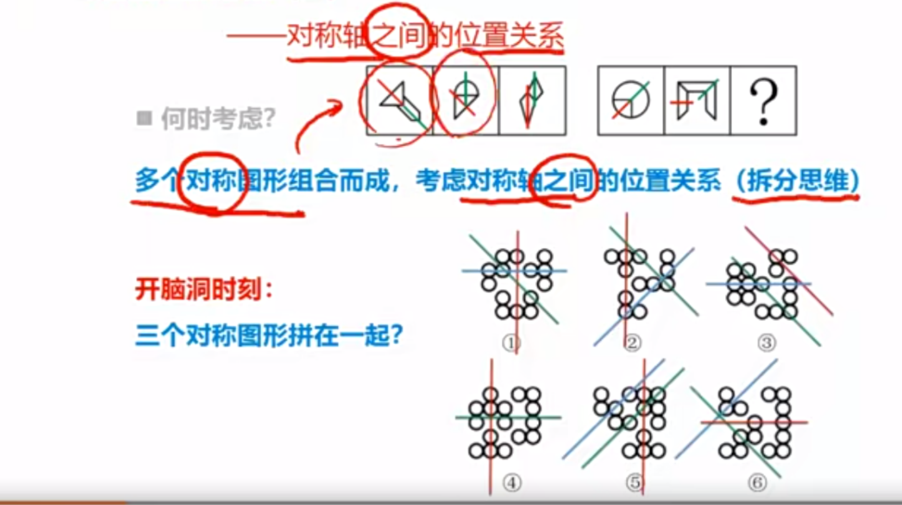
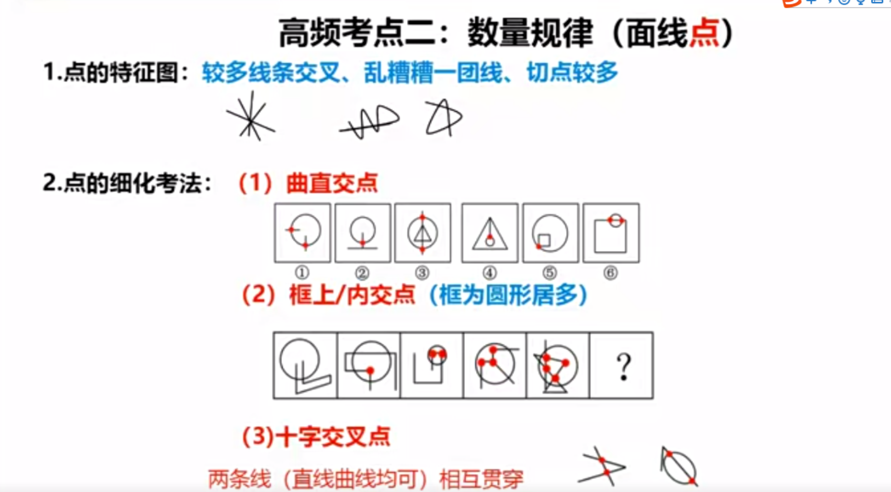
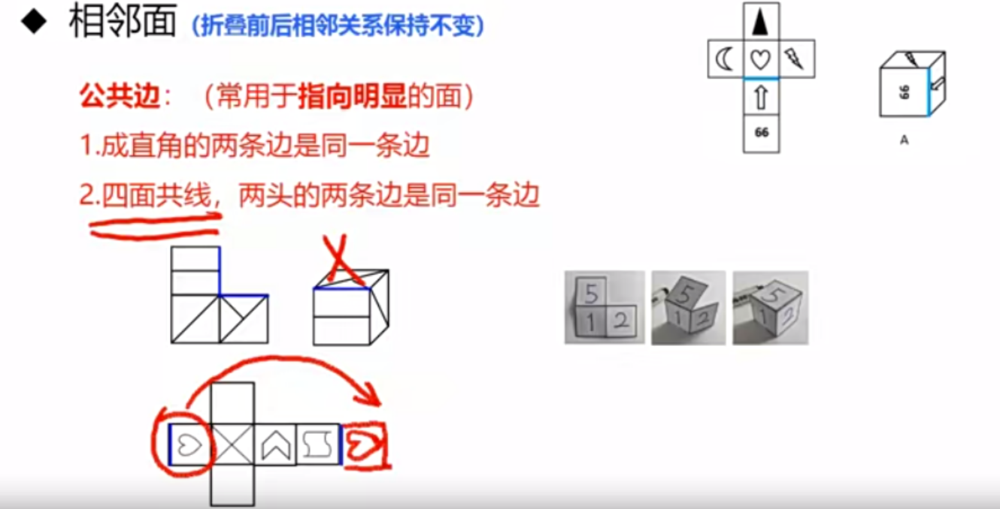
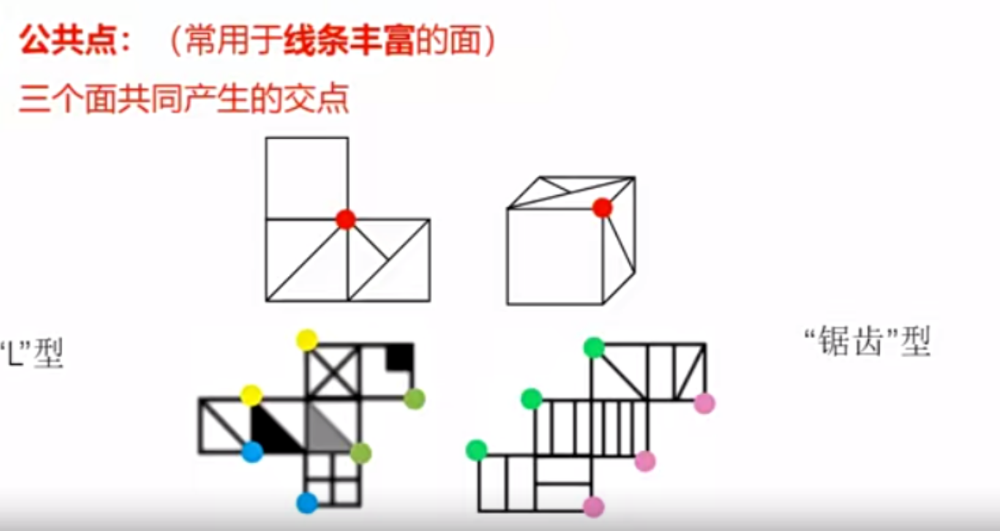

1. 一组图 12345....或者135...
2. 两组图 第一组找规律 第二组应用
3. 九宫格  第一组找规律 第二组验证 第三组应用
   - 三型
   - *川型
   - 米型
   - 己型
4. 分组分类
5. 空间重构

考点

1. 位置规律
2. 样式规律
3. 属性规律
4. 数量规律
5. 特殊规律
6. 空间重构
7. 立体图形

特征识别

1. 位置类别特征 元素组成相同

   - 平移

     方向： 直线（上下、左右、斜对角线）、绕圈（顺逆时针）

     步数： 恒定、递增（等差）

   - 旋转

     方向： 顺时针 逆时针

     常见角度： 45 90 180

   - 翻转

     左右翻转： 竖轴对称

     上下翻转：横轴对称

     往上/下  左/右图形一样

### 样式规律

元素组成相似（线条重复出现)

 1.相加、相减

2. 去同求异
3. 去异求同

黑白运算

1. 图形轮廓和分隔区域相同，内部的颜色不同
2. 方法： 相同位置运算

区分： 黑色数量相同，优先位置运算；不同，优先黑白运算

第三种：  分组分类

- 对称：轴+中心 **整体或部分** 方向
- 不连在一起：黑色数量/区域 白色数量/区域  及两者的关系
- 某种颜色的方块连在一起：想笔画

### 属性规律

**分组必须一组统一的A规律，一组统一的B规律**

元素的组成不相同、不相似（优先属性）

- 对称性

  1. 7轴对称 方向和数量
  2. 中心对称 关于这个点旋转180度和原来的图形重合
  3. **轴+中心 (存在两条垂直的对称轴)**

  考点：

  1. 性质

  2. 数量

  3. 位置

  4. 轴与图形中线、面、点的关系

     - 与原图形线重合
     - 经过原图形的n个点
     - 经过原图形的n条线线/穿过m个面

  5. 对称轴之间的位置关系

     

     

- 曲直性

  直线 曲线 直线+曲线

- 开闭性

  全封闭 

  全开放

  线+面 半封闭

### 数量规律

元素组成不相同、不相似 此时数量规律明显

点、线、面、素、角

1. 点 线与线的交点（切点也算是交点）

   

2. 线 

   - 直线
   - 曲线（平滑的曲线 没有折点） 全曲线图 圆 弧

   题型： 

   1. 直线 曲线数量关系（加减）  注意**曲直分开，内外分开，横竖分开**

   2. 开始结束线段位置关系

   3. 笔画问题 

      一笔画 线条不能重复来回画

      - 线条之间是连通的

      - 奇点数=0或2 （奇点： 由一个点发射出奇数条线）

        **切点不算奇点**

      多笔画问题

      ​	笔画数=奇点数/2（奇点数>=4 不连通分开计算）

      一笔画+外框（连通一笔画）= 一笔画

      

      日、田、圆、圆相切

      

   汉字/数字考点： 1.笔画数  2.某个笔画的数量（线数） 3. 面  4. 结构

3. 面 封闭区域

   识别

   - 图形被分割
   - 封闭面板明显
   - 出现粗线条

   题型（细化）：

   1. 所有形状的面(面的数量)
   2. 部分形状的面
      - 每个图形中相同面的个数（每个图形的面形状可以不同）
      - 某种形状的面（注意三角形）
   3. 某个形状的面
      - 最大面/最小面的形状、属性（对称性）、与外框的关系
   4. 部分数

4. 素

   **小元素特征**

   1. 元素种类
   2. 元素个数
   3. 元素替换(尤其是当2个元素时)
   4. 外轮廓 内元素
   5. 前后图形的关联
   6. 组成的元素数量关系
   7. 部分数字(线条连在一起叫一部分)特征(出现粗线条,生活化物品)

5. 角

   内角:0-180   不数外角

   题型特征: 扇形图 改造图 折线图

### 功能规律

1. 点
   - 观察点对其他图形的标记作用
   - 观察点与点之间的关系
2. 箭头
   - 观察箭头的指向性
   - 观察箭头之间的关系

###　重构规律

**所有重构题目都是排除选项优先** 

#### 六面体

1. 相对面

   - 同行或同列相隔一个面
   - Z字形两端 (紧邻z字中线的面)

2. 相邻面

   公共边： 上下左右 注意元素**方向性** 

   

   

3. 画边法

- 找特殊面的唯一点(边)

- 从唯一点(边)出发顺时针方向画边（共边+同向）

- 题干与选项对应面不一致

  

#### 四面体

展开图种类：

- 展开图中构成一条直线的两条边是同一条边
- 平行四边形两个短边是同一条边

方法

1. 公共边法  相邻面的公共边与两个面的相对位置不变
2. 画边法

#### 切截面

1. 刀无穷大 一刀切
2. 刀不能拐弯

#### 立体拼合

原则：有凹必有凸 有凸必有凹 （形状+位置）

1. 选项个数不同
2. 选项个数相同,找特殊/最大的块
3. 关注带颜色小方块的位置

#### 不规则图形折叠

根据直角边（不在同一面上）等长 

### 题目

框内交点

黑白球数量关系(差 和)

最大面(图形,轴对称...)

各个元素的数量

周长

内外圈(位置移动,黑白块数量)

平行线数量

对称轴数量

九宫图整体关于对称轴对称

对称轴与图形线条重合

外边框线数量与面的比较

直角数量

平行线数量

内/外部 直/曲线数量

相交面的对称性

2对相同的图形  1对相同的图形

黑色部分 白色部分数量关系

纯直线　纯曲线　直线＋曲线

相同元素按照一定的顺序排列

元素位置关系

相同元素的位置