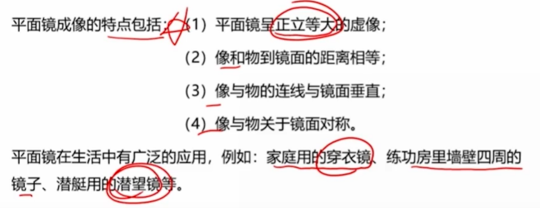
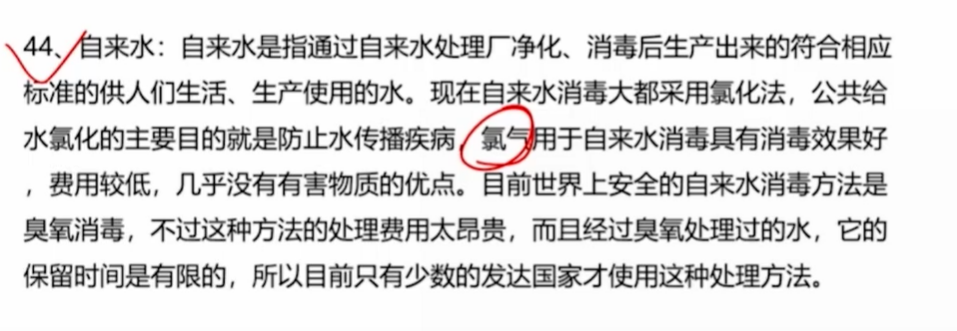
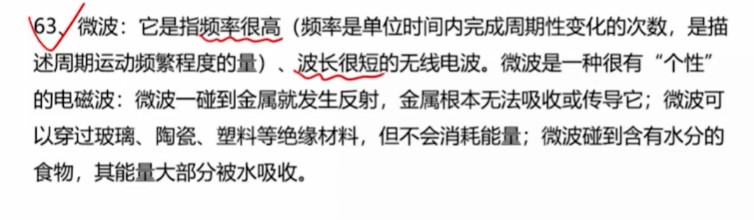
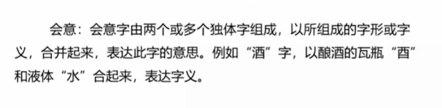
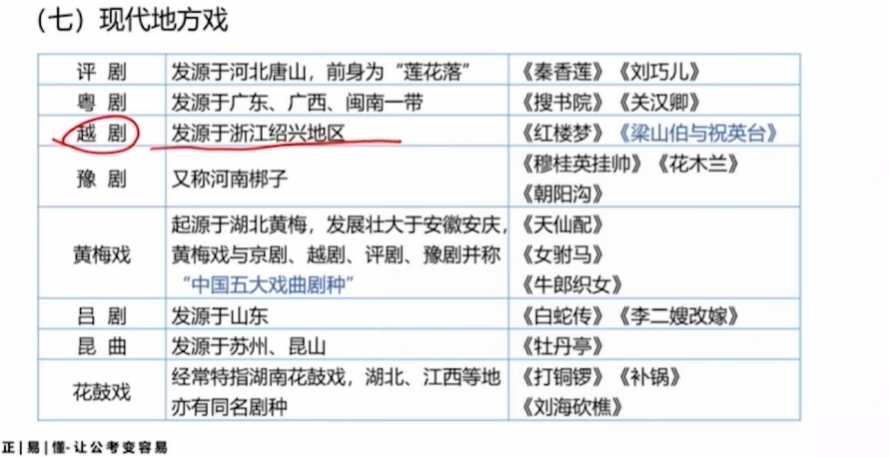

# 时政

- 斐济是和中国建交的第一个太平洋岛国

- 跳出历史周期律的2个答案: 

  1. 毛泽东 延安 让人民监督政府
  2. 十八大以来 自我革命

- 中国极点

  1. 北 漠河 极光
  2. 南 曾母暗沙
  3. 西 新疆维吾尔自治区帕米尔高原
  4. 东 黑龙江与乌苏里河交界

- 新发展格局 

  以国内大循环为主体

  国内国际双循环相互促进

  坚持 **问题导向** 和 **系统观念**

  问题导向: 主要矛盾和矛盾的主要方面

  系统观念:联系是普遍存在的

  

  统筹扩大内需和深化供给侧结构改革

  **需求牵引供给,供给创造需求**

  有收入支撑的消费需求,有合理回报的投资需求,有本金和债务约束的金融需求

  新发展格局以**现代化产业体系**(自主可控,安全可靠,竞争力强)为基础,把发展经济的着力点在**实体经济**

- 乡村振兴

  **以县城为重要载体的城镇化建设**

  脱贫结束,进入5年过度期,**增加脱贫人口收入(就业和产业)**,四个不摘(摘帽不摘**责任**、摘帽不摘**政策**、摘帽不摘**帮扶**和摘帽不摘**监管**)

- 市场化改革

  **产权保护 市场准入 公平竞争 社会信用**等市场经济基础制度

- 高水平对外开放

  **规则 规制 管理 标准**等**制度型改革**

  - 湿地
    2023年**2月2日**是第**27个世界湿地日**

    今年的主题是"湿地修复"

    我国 湿地面积排第4

    湿地(地球之肺)  森林(地球之肺)  海洋(地球之心)

- 事业单位管理条例

  年度考核

  聘期考核(>2年)

  平时考核(经常性考核)

  专项考核

- 元旦  初始之日 晋书

- 新年贺词

  全球**第二大**经济体

  全面推进乡村振兴: 产业 人才 文化 生态 组织

  

  神舟13 14 15号  中国空间站**验证阶段完成**,**进入建造阶段(14,15  15是最后一次)**

  福建号 第3艘航母  弦号18

  C919大飞机(首架交付大飞机 B-919A)
  

白鹤滩水电站 相当于2个三峡工程（但只是第二水电站，第一是三峡）  从"中国制造"->"中国创造"
  中国国际消费品博览会 海南海口 消费精品为主题

  中国精神: 民族精神(爱国主义为核心)+时代精神(改革创新为核心)

  

人才是第一资源

- 政协

  多党合作和政治协商制度

  长期共存 互相监督 肝胆相照 荣辱与共

  

- 2022 

  中国式现代化全面推进中华民族伟大复兴

  

  稳中求进工作基调  120万亿(2011破100万亿)

  团结 民主主题   坚持围绕中心,服务大局

  rcep 区域全面经济伙伴关系协定 生效

  我党明确提出**统一战线政策100周年** 矢志不渝跟党走,携手奋进新时代

- 2023

  贯彻二十大的开局之年

  东方超环EAST 人造太阳 磁约束核聚变 (核电站 核裂变)

  1月10日 第三个中国人民警察节 国家层面

  - 教师节 9月10日

  2023丝绸之路电视共同体高峰论坛

- 全面从严治党

  理论创新(引领作用)  实践创新 制度创新

  内容 对象 责任 制度

- 政治监督

  具体化 精准化 常态化

  监督体系: 党统一领导 全面覆盖 权威高效

- 作风建设

  地区性 行业性 阶段性

  把纠治形式主义  官僚注意 放在突出位置

- 反腐

  不敢 不能 不想

  行业性 系统性 地域性腐败进行专项政治

- 建党精神

  

- 二十四节气

  立春->大寒

- 贸易

  连续6年**世界第一**货物贸易国

  **东盟**连续3年成为**中国第一贸易伙伴**

- 双中心

  综合性科学中心和科技创新中心

  北京 上海 粤港澳大湾区 **西安**

- 探月工程形象-太空兔

  兔星星  to star

  探月四期 嫦娥4号~6号

  **月球的年龄**20.3亿年

- 世界经济论坛(达沃斯论坛)

  主题 - **在分裂的世界中加强合作**

  非官方国际性机构 瑞士日内瓦

- 中国共产党领导的多党合作和政治协商制度

  

  

  

  

  

  

- 两个毫不动摇

  要毫不动摇巩固和发展公有制经济

  要毫不动摇鼓励、支持、引导非公有制经济发展

- 生菜

  自主培育-中生一号

- 对外开放 平等 互利 创新 开放  惠民

- 全人类共同价值观 和平发展(事业)  公平正义(理想) 民主自由(追求)

- 元宵

  正月即元月 宵即夜 正月15即第一个月圆之夜

  

  

- 中国国际消费品博览会

  始终在海南海口 精品

  国家四大展会:  进出口商品(广交会)  国际进口(进博会)  国际服务贸易(服贸会)

- 电子元器件和集成电路国际交易中心

  北京

- 区块链和隐私计算算力集群

  hive"蜂巢" 依托长安链(首个)

- 西溪湿地

  西湖 西冷 西溪湿地 "三西"

  唯一一个 城市湿地/农耕湿地/文化湿地于一体

- 中国式现代化

  人口巨大/共同富裕/物质文明和精神文明协调/人与自然和谐共存/走和平发展道路

  根植于优秀传统文化

  蕴含 世界观/价值/历史/文明/民主/生态

- 三江源自然保护区

  2023  成立20周年

   青海  

  长江 黄河 澜沧江的源头

  中华水塔 (青藏高原是世界屋脊,**亚洲水塔**)

- 中国医疗队

  2023 对外派遣60周年  第一 阿尔吉尼亚

  中国医疗精神:不畏艰苦,甘于奉献,救死扶伤,大爱无疆

- 新民主主义革命时期

  1926-1928 北伐战争 国民政府发动的反对北洋军阀

  1927-1937 土地革命  共产党领导人民反对蒋介石反动统治

  1931-1945 抗日战争

  解放战争: 辽沈战役、淮海战役、平津战役、 渡江战役

  三座大山: 帝国主义  封建主义  官僚主义

  

  社会主义制度 在1949-1956(三大改造: 农业 手工业 资本主义工商业)以后确立 => 工业+国民经济体系    根本政治前提+宝贵经验+理论准备+物质基础

  

  十一届三中全会 改革开放

  

  十八大以来  中国式现代化

- 矛盾的普遍性和特殊性的关系

  共性和个性

- 战略

  战略问题是一个政党 一个国家的**根本性**问题

  策略(灵活性)是在战略(原则性)指导下为战略服务的

- 运动是物质的根本属性

  刻舟求剑 守株待兔

- 国家安全

  政权 制度 意识形态 重点领域

- 忧患意识 底线思维

  量变 质变

- 统筹发展和安全 

  两件大事

- 个人养老金理财

  储蓄 理财 保险 公募基金

  多层次 多支柱 养老体系

  1. 基础 政府统一
  2. 补充 企业年金/职业年金
  3. 提升 个人储蓄养老和商业养老

- 西气东输

  塔里木盆地 -> 上海

  甲烷(85%)

- 乡村文化

  "大地欢歌" 湖北武汉

- 可持续发展

  

- 中亚五国

  xxx斯坦

  陆上邻国: 哈萨克 吉尔吉斯  塔吉克 

  土库曼 乌兹别克

- 新型国际关系

  相互尊重 公平正义 合作共赢

- 第一次全国自然灾害综合风险普查调查

  旱灾影响最大,最常见,分布范围最广

- 以文化交流超越文化隔阂;以文化借鉴超越文化冲突;以文化共存超越文化优越

- 国家监察委员会

  人大产生,负责全国监察工作;主任最长5*2 10年任期

- 党政机关公文格式

  W政发[2022] 4号

  主送机构: 1.高级 2.同一级 先外后内 3.其次 党政军群

  通知结尾: 本通告自发布之日起施行

  请求上级批复结尾: 妥否/如无不妥

  书信结尾: 此致,敬礼

  

  **成文日期即签发日期**

- 民族自治地方的自治机关是人大和人民政府

  **国务院**批准后,可组织公安部队

- 一带一路路线

  =丝绸之路经济带+21世纪海上丝绸之路

  基础设施建设和贸易合作项目

  其中，"丝绸之路经济带"涵盖了欧亚大陆的地区，主要从中国西部的新疆出发，向中亚、俄罗斯、南亚、东南亚和中东等地扩展；"21世纪海上丝绸之路"则涵盖了印度洋和南中国海地区，主要从中国东南部的福建出发，向东南亚、南亚、非洲和欧洲等地扩展

  

- 人民代表大会制度是坚持党的领导、人民当家做主、依法治国“三者有机统一”

- 党的优良传统-理论联系实际、密切联系群众、批评与自我批评

  毛泽东思想 活的灵魂--实事求是、群众路线、独立自主

  中国革命的三大法宝--**统一战线，武装斗争，党的建设**

  社会主义三大改造--农业、手工业和资本主义工商业

- 中国实行积极防御的军事战略，在战略上坚持防御、自卫和后发制人的原则 

- 人民当家作主是社会主义民主政治的本质和核心，是社会主义民主政治建设的根本出发点和归宿。 

- 中国共产党第六次全国代表大会在莫斯科召开。大会通过了关于政治、军事、组织、苏维埃政权、农民、土地、职工、宣传、民族、妇女、青年团等问题的决议，以及经过修改的《中国共产党党章》。 

  党的七大总结历史经验,把党在长期奋斗中形成的优良传统作风概括为三大作风，即理论联系实际、密切联系群众和批评与自我批评。 

  八大我国生产资料私有制的社会主义改造取得决定性胜利，发展国民经济第一个五年计划即将提前完成，党面临着新的形势和任务的关键时刻。 

  九大使“文化大革命”的错误理论和实践合法化，在思想上、政治上、组织上的指导方针都是错误的。  

- 形而上学是用孤立、静止、片面的观点来看事物

- “农村包围城市、武装夺取政权”理论的提出，标志着毛泽东思想的初步形成 

  ； 新民主主义革命理论 标志着毛泽东思想走向成熟 ，是马克思主义中国化的重要理论成果 ，映中国新民主主义革命客观规律的完备理论 

- **生产决定消费**，而不是消费决定生产

- 经济建设的战略部署大体分三步走。第一步，解决人民的温饱问题 ；20世纪末，人民生活达到小康水平 ；第三步，到下个世纪中叶， 人均国民生产总值达到中等发达国家水平，人民生活比较富裕，基本实现现代化。 

- 五个坚持: 坚持中国共产党领导，坚持人民主体地位，坚持中国特色社会主义道路，坚持“和平统一、一国两制”的方针，坚持和平发展道路

- 少数民族自治区 主任或副主任必须由少数民族公民担任

  

# 生物

重伤 : 残疾/毁容/丧失视觉 听觉或其他器官功能

白细胞(吞噬异物并产生抗体)与红血球(运输氧气)，血小板(止血和凝血)并称三大血细胞 血浆能运输代谢废物和营养成分

毛细血管数量多,分布广,管壁薄,管内流速慢,管径小,只允许共细胞单行通过

吸收作用是指根系对水分的吸收

蒸腾作用指水分以气体状态通过植物体（主要是叶）表面蒸散到体外的现象

呼吸作用指生活细胞将某些有机物逐步氧化分解并释放能量的过程

骨密度在30岁左右骨成熟时达到最高，**男性下降幅度较女性小** 

卡介苗是一种疫苗，一般在婴儿出生后接种，可以预防结核病 、肿瘤的辅助治疗、治疗哮喘性支气管炎及预防小儿感冒。 

咽鼓管途径感染是临床导致中耳感染最多见的途径。 	

反刍是一种特殊的消化方式，它包括将食物咀嚼后咽下，然后将其存储在胃中进行发酵，再将其咳出口中重新咀嚼，最后再次咽下。这个过程有助于骆驼更好地消化纤维素类的食物，并从中吸收更多的营养物质。反刍还可以帮助骆驼在干旱的环境中存活，因为它们可以在一次进食中摄取更多的食物，并在后续的反刍过程中逐渐消化利用。

维生素:

a  视觉;减少呼吸道感染

b 脚气病;口角炎 如 豆类 绿色蔬菜、牛奶

c 出血

d 影响钙 磷吸收

e 轻度贫血

拟态(一种生物模拟另一种生物或模拟环境获得好处)

部分蝉具有拟态

草本植物: 一年生(如大豆)和二年生

木本植物指根和茎因增粗生长形成大量的木质部

黍: 黄米 禾本科黍属

稷(粟): 小米 禾本科狗尾草属

菽: 大豆

芫荽--香菜,原产地为地中海沿岸和中亚地区

西兰花的维生素C高于西红柿

大白菜、豌豆和韭菜的营养成分中均含有胡萝卜素

香椿昂贵在于其生长周期比较久，市场供应不足

​	

**缺氟会造成龋齿,过量会导致骨质硬化**

竞争关系: 争夺有限的资源导致双方都有抑制作用

共栖关系: 两种独立生存的生物以一定关系生活在一起的现象.其中一方得利,另一方无利无失.

寄生关系: 一方生存在另一方体内或体表.一般一方收益,一方受害

共生关系: 互利共生,如多鞭毛虫和白蚁  瘤胃微生物和牛羊

升华: 固态 -> 气态

汽化: 液态 -> 气态

凝华: 气态-> 固态  霜/雪

液化:气态->液态  凝结是液化的特例  雨

熔化:固态 ->液态   雨

凝固:液态->固态

舞台云雾的生成: 干冰升华 物理反应

红色药水: 外用消毒剂 含汞 很少使用

测血糖用酒精,碘伏会和酶发生反应,影响检查结果

红色药水和碘酒不能混用,会产生碘化汞(剧毒)

尿酸过多在肾小管处形成结晶,直接影响肾小管**重吸收**作用

公务员**最本质**特征的是 依法履行公职

蛋白质主要由碳、氢、氧、氮组成;蛋白质是人体氮的唯一来源

物联网的核心和基础是互联网

水是导电体，无论热水冷水，均可导电

可可碱过量使用可能会有头痛、腹胀、呕吐、过敏等症状，急性心肌梗塞患者禁用。但是不会导致急性心肌梗塞

荷花俗称水芙蓉

近视: 光线经眼球屈光系统后聚焦在视网膜之前(**眼球前后拉长**  凸透镜)

****

还可以分为传统能源和新能源（污染少，开发成本高）

核能既属于不可再生能源（一次能源：在自然界中现成存在的能源）又属于新能源

 \

# 天文

行星=大行星(8个)+小行星

按它们的质量大小和结构特征，又可以分为“类地行星”和“类木行星”两类，顾名思义，就是类似于地球或者是木星的两类行星

类地行星主要由石、铁等物质组成，体积小，密度大，自转慢，卫星少。水星、金星、地球、火星都属于类地行星

类木行星主要由氢、氦、冰、氨、甲烷物质组成，**体积大**，密度低，自转相当快，**卫星众多**，还有碎石、冰块或气尘组成的美丽**光环**。木星、土星、天王星、海王星都属于类木行星。

**水星和金星**都没有卫星。别的行星，如地球有一颗卫星（月亮），火星有两颗卫星，木星和土星都有超过60颗的卫星，天王星有超过20颗的卫星，海王星有超过10颗的卫星

除了以上的星体外，还有一类我们很少能碰到的星体，叫“彗星”。它们绕太阳旋转的轨道是一个非常扁的椭圆。我们只在它们接近太阳时才能看见，大多数都是隔几十年，几百年甚至几千年才能碰到一次。我们平时听说的“哈雷彗星”，就是属于这一类星体

我国周边海域和南海位于环太平洋地震带

羲和中国神话的太阳女神

银河 俯视漩涡  侧视双凸透镜 

铁陨石也称"陨铁",主要成分是铁 镍等金属

台风: 又称飓风,热带气旋 发生在热带或亚热带洋面上的低压漩涡.带来淡水资源,冷热均衡.一般以逆时针方向旋转.

一般温带气旋不会转化为热带气旋

时区

- 全球24个
- 印度-新德里 东5区  比伦敦 0时区 早(向东加一个小时)
- 目前世界上拥有时区最多的国家是**法国**
- 中国的所有省份统一使用东八区时间

秋天气温逐渐降低是因为太阳直射点到了南半球，七月初是地球离太阳最远时间，一月初是地球离太阳最近时间

# 法律协议

大陆法系，是指欧洲大陆上源于**罗马法**、以 1804年《法国民法典》为代表的各国法律，所以大陆法系也称罗马法系或**民法法系**。1896年，德国以《法国民法典》为蓝本，制定了《德国民法典》，该法典以后为一些国家所仿效，故大陆法系又称为罗马—德意志法系。属于这个法系的除法国、德国两国外，还有奥地利、比利时、荷兰、意大利、瑞士、西班牙、明治维新后的日本以及亚、非、拉部分法语国家或地区的法律

英美法系亦称“**普通法系**”、“英国法系”、“**判例法系**”、“海洋法系”。**以英国普通法为基础发展起来的法律的总称。**英美法系的陪审团在诉讼功能上，仅对个案的事实问题进行认定和判断，而不能对适用法律发表看法，法律适用权只能由法官来行使，即**陪审团成员仅有事实认定权而无法律适用权**

巴黎协定是对2020年后全球应对气候变化的行动作出的统一安排,于2015年在巴黎气候大会通过,2016年正式实施,是已经到期的《京都议定书》的后续.第一部具有法律 约束力的气候约定是 **联合国气候变化框架公约**	

三八妇女节: 纪念俄国女工在二月革命的贡献

五一:纪念美国芝加哥工人"五一"罢工

5/12国际护士日:纪念英国南丁格尔

5/8国际红十字日: 创始人亨利-杜南生日

6/1: 利迪策惨案

1985/9/10 第一届教师节

最早纸币-北宋

首次提出数字"0"-古印度

首次环球航行-西班牙

"日心说"-文化复兴

苏联解体,东欧剧变-20世纪90年代

民法典-收养: 无子女或者只有一个子女

商家刊登用药照片 **肖像权**而非名誉权

民法典-撤销婚姻: 1. 胁迫 2.重大疾病未告知 

**其他情况可以考虑离婚**

精神补偿: 1. 重婚 2.与他人同居 3.家庭暴力 4.虐待家庭成员

宪法基本原则:  人民主权+基本人权+权力制约+法治

省级(自治区 直辖市)建置全国人大,乡建区域省政府,其余都是国务院

成年人(满18)为完全民事行为能力人; 满16岁**以自己劳动收入作为主要生活来源**的视为完全民事行为能力人;8岁以上限制民事行为能力人,其行为由其法定代理人代理,但可以独立实施获取收益的民事法律行为或与智力向适应的民事行为;8岁以下或不能辨认自己行为的成年人为无民事法律行为

正当防卫:  1. 存在不法侵害 2.不法侵害正在进行 3.针对侵害人防卫 4.没有超过必要限度

法定公文: 纪要/议案/通报 不包含条例

违法行为2年内不被发现,不再除以行政处罚;涉及公民生命健康和金融安全的期限延长至5年

夫妻共有财产：1.工资 奖金 2. 生产投资的收益 3.知识产权收益

4. 继承赠与（无明确表示归于一方） 5. 其他

夫妻一方财产： 1. 婚前 2. 一方因受伤获得的补偿 3. 其他

立医嘱后，遗嘱人实施与遗嘱内容相反的法律行为，视为对遗嘱相关内容的撤回

醉酒驾驶机动车，不一定就构成交通肇事罪 ；醉酒危险驾驶罪 ；酒后驾驶 严重的违法行为

公安机关办理行政案件的证据包括：（一）物证；（二）书证；（三）被侵害人陈述和其他证人证言；（四）违法嫌疑人的陈述和申辩；（五）鉴定意见；（六）勘验、检查、辨认笔录，现场笔录；（七）视听资料、电子数据。证据必须经过查证属实，才能作为定案的根据。” 

根据《民法典》第七百零六条规定：“当事人未依照法律、行政法规规定办理租赁合同登记备案手续的，不影响合同的效力。” 

 （RCEP）正式生效，该协定旨在通过削减关税及非关税壁垒，建立统一市场。文莱、柬埔寨、老挝、新加坡、泰国、越南等6个东盟成员国和中国、**日本**、**新西兰、澳大利亚**等4个非东盟成员国正式开始实施协定 

公安机关讯问犯罪嫌疑人时至少应当有**两名侦查人员**在场。 犯罪嫌疑人被送交看守所羁押以后，侦查人员对其进行讯问，应当在看守所内进行。 

**行政诉讼**+民事诉讼+刑事诉讼

国务院的组成部门包括：外交部、科学技术部、国家安全部、司法部、人力资源和社会保障部、生态环境部、交通运输部、农业农村部、文化和旅游部、退役军人事务部、国防部、教育部、工业和信息化部、公安部、民政部、财政部、自然资源部、住房和城乡建设部、水利部、商务部、应急管理部、国家发展和改革委员会、国家民族事务委员会、**中国人民银行**、国家卫生健康委员会、审计署共计26个

**国有资产监督管理委员会是国务院直属特设机构**

**第二审人民法院**审理被告人或者他的法定代理人、辩护人、近亲属上诉的案件，**不得加重被告人的刑罚。**第二审人民法院发回原审人民法院重新审判的案件，除有新的犯罪事实，人民检察院补充起诉的以外，原审人民法院也不得加重被告人的刑罚。**人民检察院提出抗诉或者自诉人提出上诉的，不受前款规定的限制**

因当事人一方的违约行为，损害对方人身权益、财产权益的，受损害方有权选择请求其承担违约责任或者侵权责任。(可能会导致对同一损害事件的 **双重赔偿**)

植物新品种属于只是产权，动物新品种则不是（**伦理考虑**）

违法行为发生地，包括违法行为的实施地以及开始地、途经地、结束地等与违法行为有关的地点

夫妻关系、直系血亲关系、三代以内旁系血亲以及近姻亲关系的、

公司可以设立子公司。子公司具有法人资格，依法独立承担民事责任。分公司不具有法人资格

任何组织或者个人不得以刺探、**侵扰**、泄露、公开等方式侵害他人的隐私权。

（一）入户抢劫的；（二）在公共交通工具上抢劫的；（三）抢劫银行或者其他金融机构的；（四）多次抢劫或者抢劫数额巨大的；（五）抢劫致人重伤、死亡的；（六）冒充军警人员抢劫的；（七）持枪抢劫的；（八）抢劫军用物资或者抢险、救灾、救济物资的。”

《民法通则》规定，可撤销的民事法律行为的类型有：重大误解；显失公平； 欺诈、胁迫。 

国家坚持**理性**、**协调**、**并进的核安全观**， 加强核安全能力建设，保障核事业健康发展 

犯罪的未完成形态，是相对于犯罪的完成形态——犯罪既遂而言的，有犯罪 预备、犯罪未遂和犯罪中止三种类型。 

旅馆、宾馆、酒店等住宿经营者接待未成年人入住，或者接待未成年人和成年人共同入住时，应当**询问**父母或者其他监护人的联系方式、入住人员的身份关系等有关情况

# 经济

货币政策: 政府 中央银行和相关部门采取的影响金融的措施.如存款准备金率,利率,公开市场操作(如国债,债券等).**消费券不属于**

乘数效应（Multiplier Effect）是一种宏观的经济效应，也是一种宏观经济控制手段，是指经济活动中某一变量的增减所引起的经济总量变化的连锁反应程度

一次性塑料餐盒属于其他垃圾(回收价值比较低)

公务员**最本质**特征的是 依法履行公职

以前我们认为市场经济属于资本主义，计划经济属于社会主义，现在认识到资本主义也有计划经济，社会主义也有市场经济，**市场经济不属于社会基本制度范畴**，是资源配置方式而已

“设立股份有限公司，应当有二人以上二百人以下为发起人，其中须有半数以上的发起人在中国境内有住所。”一人不得设立股份有限公司。 可以其家庭共有财产作为个人出资申请登记 ；个自然人只能投资设立一个一人有限责任公司 

低碳生活 主要是从节电、节气和回收三个环节来改变生活细节 

供给量不仅受到产品成本、相关商品的价格、生产要素的价格、政府的租税或补贴政策等因素的影响，而且最终必须经过交换，受到商品销售价格的影响。**在通常情况下，供给量总是随着价格上升而增大，随着价格下跌而减少，需求量无法直接决定供给量。**

# 经济

2023 中国国民生产总值增长目标为 **6.5%**以上

锂离子电池相对于其它两种电池的优势在于 ①重量轻②**安全性低（**使用错误将会出现电解液分解、燃烧甚至爆炸的重大事故 **）**③绿色环保④高低温适应性强。 

#  公文

三查三改: 查立意 查措施 查材料

五查五改: 查文种 查标题 主抄送单位 附件 附件标记

决定 vs 决议

性质 强制性,一次性,针对事务  vs 机关集体

目的 对某项具体事务作出的确定性的、强制性的决定 vs 一种事物的看法或态度

法律效力 强制性 vs 不具有直接强制力

**无需标注附件说明**，直接附上附件

多附件用阿拉伯数字

附件名称较长需要回行，应与上一行附件名称首字对齐

**向上级机关行文的**，原则上主送一个 上级机关，根据需要同时抄送相关上级机关和同级机关，**不抄送下级机关** 

下级机关的**请示**事项，如需以本机关名义向上级机关请示， 应当提出**倾向性意见**后上报，不得原文转报上级机关  

要教育孩子遇到同班溺水时避免手拉 手盲目施救，要智慧救援，立即寻求成人帮助  

国务院，中央人民政府最高国家机关的执行机关，最高行政机关

国家主席是我国重要的国家机构，是一个独立的国家机关

#  历史

1945 上党战役

1947 孟良崮战役 辽沈

1948 淮海 平津

1949 渡江

老西藏精神: 缺氧不缺精神

井冈山精神: 马列主义与中国革命具体实践相结合

西柏坡精神:巩固和加强共产党执政地位

新文化运动: 陈独秀 李大钊 鲁迅等;后期传入了马克思主义,李大钊是在中国举起十月革命旗帜第一人;四提倡,四反对

汉宫春晓图 仇英 仕女图

韩熙载夜宴图 顾闳中

百骏图 清郎世宁

千里江山图 北宋王希孟

阳燧取火 凹面镜聚光

三湾改编  党对军队的绝对领导

日本投降  1945年

沪松战役: 国民党 vs 日军  中方战败

太原会战: 多场战役

平型关大捷 共产党 vs 日军  中方胜利 中等战役

台儿庄战役 国民党 vs 日军  中方胜利 正面战场最大的一场胜利

桂陵之战/围魏救赵

衡始弱冠，而融年四十，遂与为交友

鼎最初是烹煮食物，在青铜器出现后，又成为祭祀神灵的一种重要礼器

党的第几次全国代表大会选举产生的中央委员会，就是第几届中央委员会

党的几届几中全会，是指党的第几届中央委员会第几次全体会议

按照《党章》规定，党的中央委员会每年至少举行一次，这就是我们平时所说的“全会”或“中央全会”。

1938年 六届六中全会 马克思主义中国化

十八大 两个一百年

十八届四中全会 全面推进依法治国

八大 团结国内外一切可能团结的力量

党的七大 将毛泽东思想确立为中国共产党的指导思想。

六届七中全会 在全党确立毛泽东领导地位的重大意义

十一届六中全会 彻底否定了“文化大革命”

苏联解体、东欧剧变不仅是**20世纪**一场巨大的地缘政治灾难

宣(安徽宣城 )纸最早出现在唐朝;紫砂壶 宋代;刺绣 殷商西周;陶器/漆壶 新石器时代;

 

商丘--商族始祖受封地

商鞅受封地--商洛市

《共产党宣言》发表于1848年2月21日；十月革命发生于1917年11月7日

二十四史:

1. 史记 西汉 司马迁
2. 汉书 东汉 班固
3. 后汉书 南朝宋 范晔
4. 三国志 西晋陈寿
5. 晋书 唐 房玄龄
6. 宋书 南梁 沈约
7. 南齐书 南梁 萧子显
8. 梁书 唐 姚思廉
9. 陈书 唐 姚思廉
10. 魏书 北齐 魏收
11. ...
12. 隋书 唐魏征
13. 旧唐书 后晋 刘询
14. 新唐书 北宋欧阳修
15. 新五代 北宋欧阳修
16. 宋史/辽史/金史 元脱脱
17. 元史  明宋濂
18. 明史 清张廷玉

郑和下西洋和麦哲伦环球旅行都是在明代

一战赶走了国王(贵族)，二战打垮了欧洲

在第一次世界大战中，英法代表**资本的力量**和**传统技术强国**，而德奥代表的是**君权**以及**新兴技术强国**，俄罗斯是由于民族冲突以及远交近攻的因素而加入英法，美国最后倒入英法怀抱则是政权性质以及风险收益比。一战中交战双方的焦点是资源和市场、以及远交近攻。最后英法胜出，说明先发国家的积累优势很强大。

如果说一战抢夺的是资源和市场，那么二战抢夺的更多的是市场。一战更多的是人心使然，而二战更多的是经济市场、历史遗留。所以一战是偶然为主，而二战则是必然为主。交战双发，英美法、德日意，双方都是资本力量的代表，一方资本控制国家权力，一方是国家权力控制资本；一方代表的是海权国家，一方代表的是陆权国家；一方代表的是传统强国，一方代表的是新兴强国。最后结果如何，代表**[自由资本](https://www.zhihu.com/search?q=自由资本&search_source=Entity&hybrid_search_source=Entity&hybrid_search_extra={"sourceType"%3A"answer"%2C"sourceId"%3A99284842})的传统海权强国**打败了代表**权力资本的陆权**新兴国家

中途岛海战 美vs日 二战 以少胜多

凡尔登 法vs德 一战 凡尔登绞肉机

索姆河战役/马恩河 英法 vs 德   一战

斯大林格勒大会战/莫斯科  俄国  vs 德  二战

诺曼底 英美加拿大 vs 德  二战

工业与信息化部是在 2008 年机构改革中将原有工业部和信息产业部合并而来的部门 自然资源部/文化和旅游部/退役军人事务部 2018年	

近代三次启蒙思潮

1. 维新变法思潮  后随戊戌变法的失败而流产 
2. 君主立宪思潮是维新变法思潮的进一步发展  它首次主张君主共民，实行议院制度 
3. 民主共和思潮  民族主义、民权主义（核心）、民生主义 
4. 五四运动

《九章算术》是古代张苍、耿寿昌所 撰写的一部数学专著 、

成都，别称蓉城、锦城，星城一般指长沙

A.昆明一春城 B.济南一泉城 D.广州一羊城 

# 哲学

认为名字能改变人的一生的气运 属于客观唯心主义观点

气者，理之依也 精神是依赖于物质的  古代朴素唯物主义观点

道者器之道，无其器则无其道 强调抽象的道离不开具体的事物 古代朴素唯物主义观点

未有此气，已有此理 “理”是本原，“气”是派生的 客观唯心主义观点

邓小平 首要的基本问题是搞清楚: 什么是社会主义;怎样建设社会主义

“只闻其声，不见其人”是因为声波的波长比光波波长要长的多，容易发生衍射现象，所以它能绕过一般的障碍物而被另一侧的人听到，光波波长较短，不能绕过障碍物，只能沿直线传播，也就产生了只闻其声不见其人的现象，属于衍射现象，和干涉无关

干涉一般处理的是有限的相干光束的叠加。衍射本质上也是干涉，只是处理的是波面上无数个子波源发出的子波的干涉。

**量变**是事物数量的增减和次序的变动，是**保持事物的质的相对稳定性的不显著变化**

事物的发展是前进性和曲折性的统一

**发展实质是新事物的产生和旧事物的灭亡**

真理就是**客观事物及其规律在人的意识中的正确反映**。追求真理是一个过程，因为认识具有反复性。

病树前头万木春  事物是变化发展的，新事物必然战胜旧事物

古歌旧曲君休听，听取新翻杨柳枝   事物是变化发展的，不可因循守旧

唯有源头活水来 运动是物质的根本属性

生产力：改变自然以适应社会的物质力量 

生产关系：物质生产过程中不以人为意志转移的经济关系

经济基础：生产力+生产关系

石破天惊 ： 难以形容的奇境，后多比喻文章议论新奇惊人

# 地理

客家土楼，属于庭院式住宅，是客家人聚族而居的堡垒式住宅。主要有**福建**客家土楼、**广东**客家土楼和**江西**客家土楼，分布在福建的永定、龙岩、南靖、平和、诏安，广东的梅州、饶平、深圳和江西赣南等地。在云南不可能拍摄到客家土楼。

中国**天眼**一般指 500米口径球面射电望远镜，位于中国**贵州**省黔南布依族苗族自治州境内，是中国国家“十一五”重大科技基础设施建设项目。在贵州可能拍摄到天眼检修。

丹霞地貌形成于红色砂岩和砾岩层，经过长期风化和流水侵蚀，形成了孤立的山峰和陡峭的奇岩怪石。中国的丹霞地貌广泛分布在热带、亚热带湿润区，温带湿润－半湿润区、半干旱－干旱区和青藏高原高寒区。**28个省**具体分布在：福建泰宁、武夷山、连城、永安；甘肃张掖；湖南世界自然遗产邵阳新宁县崀山、湖南省郴州市苏仙区飞天山国家地质公园，郴州市永兴县便江风景区等地。在湖南可能拍摄到丹霞地貌。23+5（自治区）+4（直辖市）+2

黄河发源于青藏高原巴颜喀拉山北麓的约古宗列盆地，自西向东分别流经青海、四川、甘肃、**宁夏**、内蒙古、山西、陕西、河南及山东 9个省（自治区），最后流入渤海。

黄河: 青海->渤海  长江: 青海->东海

颐和园以昆明湖、万寿山为基址，以杭州西湖为蓝本

纯铁是一种**白色**或者银白的金属，并非黑色  

- 氧化铁 红色
- 氢氧化铁 红褐色
- 四氧化三铁 黑色

铝 银白色

铜 红色；氧化铜 黑色

喜马拉雅山 世界第一高峰  穿过中国 不丹 印度 巴基斯坦 尼泊尔等

昆仑 万山之祖  西起帕米尔高原 横贯新疆 西藏至青海

安第斯山脉 从北(加勒比海岸)到南(南美洲)贯穿南美洲西岸 世界最长

落基山脉 南北加拿大->美国西南

阿尔卑斯 欧洲最大 温带和亚热带

高加索山脉 亚洲和欧洲分界线 欧洲第一高

台风：	

1. 形成台风，要有广阔的高温、高湿的大气 
2. 形成台风，要有足够大的地球自转偏向力，因赤道的地转偏向力为零，而向两极逐渐增大，故台风发生地点大约离开赤道5个纬度以上。由于地球的自转，便产生了一个使空气流向改变的力，称为“地球自转偏向力” 
3. 形成台风，低层大气要向中心辐合、高层向外扩散的初始扰动。而且高层辐散必须超过低层辐合，才能维持足够的上升气流，低层扰动才能不断加强。 
4. 在弱低压上方，高低空之间的风向风速差别要小  也就是垂直方向风速差 **小**

位于亚洲东部，太平洋西岸;温、热三带，大部分在北温带

从我国的最北端的黑龙江省漠河，到我国最南端的海南省曾母暗沙，直线距离约**六千**公里。

我囯最東部到最西部地表直线距离 5200km

# 时政蒙题方法

命题人出时政题的主要目的

1. 对正面人物、正面热点事件进行宣传
2. 告诉你要跟谁走，谁能带来幸福生活
3. 告诉你党和国家现在在干什么事

五大意识，九大原则

- 国家意识

  **中国/地区对世界的影响力，文化自豪等**

- 政治意识

  

  马克思主义包括了社会主义的理论、

  **巩固国防和强大人民军队**是实现中华民族伟大复兴的战略支撑 

  **党1921年成立**

- 政策意识

  当下习大大及党中央在各方面的**政策大方向**

  **所有违背大方向的选项都是错的**

  1. 新发展阶段，第二个100年奋斗目标

     2020年（**全面建成小康社会、脱贫攻坚已经完成**）

     2049年  建成富强民主文明和谐的社会主义现代化国家 

     - 2035 **基本**实现现代/xx/....化
     - 2050 **全面**建成现代化，实现**共同富裕**

     

     **(基本)实现共同富裕是在2050年**

     建设教育强国是一项复杂的系统工程，需要我们紧紧围绕**立德树人**这个根本任务

  2. 十四五规划 2021-2025

  3. 党的全面领导

     党领导一切

     中国共产党领导，是中国特色社会主义的**本质特征和优势**

  4. 全面从严治党

     

  5. 经济建设

     

     **发展是第一要务,科技自立自强是促进发展大局的根本支撑**

     习近平的都是**新**的东西 不像 小康社会，坚持有法可依，有法必依...等旧的

     **高质量发展，必须紧紧依靠工人阶级和广大劳动群众，开启新征程，扬帆再出发**。 

  6. 社会建设

     

  7. 生态文明建设

     

  8. 军队建设

     

  9. 三农问题（乡村振兴）

     

     **耕地红线 --- 农产品主产区不能进行任何工业化开发** 耕地转林地也会受到限制

  10. 共同富裕

      
  
      

十五届五中全会 经济发展着力点**实体经济**上 

深圳 **中国特色社会主义先行示范区**

- 人本意识

  

  警察出警过程中造成的损失由**国家**补偿

- 法律意识

  **朴素价值观**

  **非诉讼**：非诉讼就是法律事务不通过诉讼方式，简单说就是**不通过法院、仲裁委员会** 

  公务员试用期**1年**

  投保单（个人），保险单（公司） 以投保单为准 **且保险凭证以形成时间在后的为准**

  格式条款：制式条款 非格式条款：补充双方协商内容

  政府信息公开除了确定不能公开的，都需要公开

  16岁以上 完全刑事责任能力人

  12岁(以前是14岁)以下 完全无刑事责任能力人

  12-16 限制刑事责任能力人  只对两杀（故意杀人，故意伤害致人重伤），两抢（抢劫，强奸），两火（放火，爆炸），两毒（贩毒，投毒）承担刑事责任

  **一事不再罚：一事不会被多个部门惩罚**

  结婚： 男>=22 女>=20

  管制/拘役/有期徒刑/无期徒刑

  RX 处方药

- 信息匹配

  当题目抄中出现的信息比较多，可采用类似做**言语理解**和**定义判断**的方式做题，找到**关键词**，进行**匹配**

  慈善组织归**民政**部门管

- 3+1选项

- 选项矛盾

- 最大信息化

- 绝对化观点

- 属性交叉

- 并列选项

- 高频替代词

- 数字选项

党员： **政治标准**为首位；民主集中制组织成的整体；警告+严重+撤销党内职务+留党查看+开除党籍

解决好世界观、人生观、价值观这个总开关问题，而非政绩观

支持和保证人民通过人民代表大会行使国家权力

改革开放是决定当代中国命运的关键一招，也是决定实现‘两个一百年’奋斗目标、实现中华民族伟大复兴的关键一招。

建设教育强国，必须以坚持党对教育事业的全面领导为根本保证，为国育才为根本目标，以服务中华民族伟大复兴为重要使命，以教育理念、体系、制度、内容方法、治理现代化为基本路径，以支撑引领中国式现代化为核心功能，

全面从严治党，十八大（14年）

2024年1月24日世界首台“用于太阳磁场精确测量的中红外观测系统”（简称AIMS望远镜）

科技金融、绿色金融、普惠金融、养老金融、数字金融五篇大文章

# 国情省况

### 自然地理

中国地理

![中国省份地图高清版大图下载_中国省份地图高清版大图电子版[高清地图]-PC下载网](../%E4%BA%8B%E4%B8%9A%E5%8D%95%E4%BD%8D/assets/9dccd69198a25e9a45a71c7222e54d64.jpg) 1、山东——济南；2、河北——石家庄；3、吉林——长春；4、黑龙江——哈尔滨；5、辽宁——沈阳；6、内蒙古——呼和浩特；7、新疆——乌鲁木齐；8、甘肃——兰州；9、宁夏——银川；10、山西——太原；11、陕西——西安；12、河南——郑州；13、安徽——合肥；14、江苏——南京；15、浙江——杭州。

　　16、福建——福州；17、广东——广州；18、江西——南昌；19、海南——海口；20、广西——南宁；21、贵州——贵阳；22、湖南——长沙；23、湖北——武汉；24、四川——成都；25、云南——昆明；26、西藏——拉萨；27、青海——西宁；28、台湾——台北

直辖市： 北京市，上海市，天津市，重庆市。 

### 人文地理

### 浙江省情

浙江文化名人：

1. 陆游
2. 刘伯温
3. 骆宾王 
4. 王守仁 
5. 龚自珍 
6. 于谦 
7. 孟郊 
8. 宋濂 
9. 徐志摩 
10. 王充 论衡

王夫之  湖南人

顾炎武  江苏人

# 政治

国务院有权改变或者撤销地方各级国家行政机关的不适当的 决定和命令  

全国人大决定全国总动员或者局部动员口 

### 马克思主义中国化

社会主义社会的基本矛盾具有以下特点：（1）社会主义的生产关系是以生 产资料公有制为基础的，只有通过无产阶级革命和无产阶级专政自觉地建立起来。（2）社会 主义社会的基本矛盾是人民内部根本利益一致基础上的非对抗矛盾，它完全可以通过社会主 义制度自身的自我调节不断得到解决，不断适应生产力发展和社会进步的要求。（3）社会主 义社会的基本矛盾的双方相适应的一面是基本的、主要的，不适应的一面是非基本的、次要 的，它可以通过社会主义制度的自我完善而求得解决。（4）社会主义社会的基本矛盾依然是 生产力与生产关系、经济基础和上层建筑的矛盾 

### 新时代中国特色社会主义

### 中国党史

坚持实事求是最需要解决的是**党性**问题 

# 经济

1. 流通中的货币量超过实际需要的货币量，从而引起的货币贬值和物价水平全面而持续的上涨的经济现象叫作通货膨胀。通货膨胀率高时，失业率低；通货膨胀率低时，失业率高。

2. 税收的特征有：（1）无偿性。指国家征税以后，其收入就成为国家所有，不 再直接归还纳税人，也不支付任何报酬。（2）强制性。指国家依据法律征税，而并非一种自 愿缴纳，纳税人必须依法纳税，否则就要受到法律的制裁。（3）固定性。指国家以法律形式 预先规定征税范围和征收比例，便于征纳双方共同遵守 

3. 宽松的货币政策 ：  A 降低存款准备金率 B.降低再贴现率（**贴现率从定义上理解就是将来的钱折算到现值，少掉或多出的那部分钱与将来的钱的比值就是，贴现率越高，能拿到的钱就越少** ；再贴现率就是银行资金不够时，向中央银行再次用商业票据贴现融通借款） C.放松信贷条件和规模  D. 增大货币发行   **减税不属于货币政策（财政政策）**
4. 永续债券又称无期债券，是指没有确定到期日的债券。投资者购入永续债后，不能在确定时点收回本金，但可以每年按票面利率永久获取利息。在我国，永续债市场空间广阔，有必要支持企业发行永续债补充资本，提升金融服务实体经济和抵御风险的能力。
5. 推进股票发行**注册制**改革，多渠道推动股权融资，发展并规范债券市场，提高直接融资比重
6. 生产要素包括劳动力（劳动）、土地、资本、信息四种，在社会经济发展的 历史过程中，不断的有新的生产要素，如现代科学、技术、管理、信息、资源等  
7. 财政收入：税收、公费收费、公债收入
8. 

# 历史文学和科学技术

### 中国古代史

1. 早期人类（旧石器）

元谋 人->蓝田人->北京人->山顶洞人

云南元谋县  陕西蓝田县

北京人：天然火   山顶洞人：人工火

新时期时代(母系氏族公社阶段)  仰韶文化(黄河)和河姆渡文化(长江) 半坡

1. 三皇五帝

   

   燧人  钻木取火；伏羲：八卦；神农：农业和医药

   黄帝  颛顼（zhuanxu） 帝喾（ku） 尧  舜

   史记记载了从黄帝到汉武帝，为二十四史之首；最后一部为 明史 崇祯

   尧开创了禅让制

   

   1. 夏商周（奴隶制）

      

      人类社会有5种社会形态：原始 奴隶制 封建制 资本主义 社会主义

      夏朝（公元前21世纪）开始进入奴隶社会

      夏商周又称为**青铜器**时代

      大禹治**黄河**

      从**启**开始从禅让制变成世袭制 公天下->家天下

      夏历 按照月球  又称农历

      

   

   

   

   ​	谋圣 姜子牙 ； 商圣 范蠡 ； 科圣 张衡 ；至圣/文圣 孔子 ； 亚圣 孟子； 医圣 张仲景 元圣 周公

   ​	武圣 关羽 ； 智圣 诸葛亮；书圣  王羲之；草圣 张旭； 画圣 吴道子； 诗圣 杜甫；兵圣 孙武

   ​        词圣 苏轼；曲圣 关汉卿

   1. 西周

   

   

   

   ​	

   1. 东周

      

      城濮之战-晋楚之间

      都城总结

      1. 西周-西安  东周-洛阳
      2. 西汉-西安 东汉-洛阳
      3. 西晋-洛阳 东晋-南京（建康）
      4. 北宋-开封  南宋-杭州（临安）
      5. 北京是元明清的都城  其中朱元璋在南京

   

   ​	古代的医生

   1. 扁鹊：战国  难经 望闻问切 脉学之宗
      1. 华佗：东汉 青囊经 全身麻醉 五禽戏
      2. 张仲景：东汉 伤寒杂病论 医圣
      3. 孙思邈：唐 千金方 药王
      4. 李时珍：明 本草纲目 东方医药巨典 

   

   

   

   

   

   

   世界三大宗教： 

   1. 佛家 产生时间最早

   2. 基督教 信仰人数最多

   3. 伊斯兰教

      均产生于亚洲

《诗经》中关于西周日食的记录是我国历史上第一次有确切日期的**日食**记录

《春秋》中留下了关于**哈雷彗星**的最早记录

夏商周 奴隶制社会

秦~1956年三大改造完成 封建社会

度: 长度单位  量: 容积 横:重量

以少胜多的战役:

1. 牧野之战  武王伐纣
2. 巨鹿之战 项羽破秦
3. 官渡 曹操vs袁绍
4. 赤壁  曹操 vs 孙刘联军
5. 淝水之战 东晋 vs 前秦
6. 淮海

垓下之战 -- 追击战

夷陵之战 -- 以逸待劳

执金吾(yù)，西汉末年时率禁兵保卫京城和宫城的官员

刘邦 约法三章

西汉灭亡-王莽篡权  东汉灭亡-曹丕称帝

选官制度:

1.西周至春秋 西周至春秋

2. 秦 军功授爵制

2. 察举制 西汉

2.九品中正制

3.科举制

**造纸术出现在西汉**

中国医学四大经典:

1. 黄帝内经(之首)
2. 神农本草经
3. 扁鹊 难经
4. 张仲景 伤寒杂病论

二十四节气: 世界非物质遗产

太阳由内而外: 1. 光球层(黑子)  2. 色球层  3.日冕层

记载历史的方式:

1. 纪传体  以人物为中心
2. 编年体  以时间为中心  资治通鉴(第一部)
3. 国别体 以国家为中心 国语

资治通鉴和史记并称史学双璧

汉书 又称 前汉书 写的西汉  ;后汉书 写的东汉

班固是东汉著名的史学家、文学家 .

班超是东汉著名的军事家、外交家.

班固和班超是兄弟关系，他们的父亲是班彪。

投鞭断流 草木皆兵

刘勰 文心雕龙 我国第一部文学评论专著

事物的绝对运动和相对静止的相统一

关于"诗"

1. 诗狂 贺知章
2. 诗佛 王维
3. 诗仙 李白
4. 诗圣 杜甫
5. 诗囚 孟郊
6. 诗魔,诗王 白居易
7. 诗鬼 李贺
8. 诗神 苏轼

田园: 王维 孟浩然

边塞: 高岑 王之涣

送元二使安西 渭城指陕西咸阳

描写的是**冬天**的景象

字子美,诗歌以**安史之乱**为背景

反对骈体文,提倡秦汉时期文体

山寺桃花始盛开  矛盾的普遍性和特殊性

翘楚诗人

内因是依据

四大发明的先后顺序:

1. 指南针  战国司南
2. 造纸  西汉
3. 火药火器  唐末
4. 活字印刷  北宋

新四大发明

1. 高铁
2. 共享单车
3. 支付宝
4. 网购

宋应星 明  天工开物  17世纪工艺百科全书

我国第一部编年体史书-春秋

我国第一部 记事详备编年体史书-左传

纪事本末体--南宋袁枢的《通鉴纪事本末》

字 子瞻 字和仲  号铁冠道人

元上都 内蒙古

利玛窦 意大利传教士 明朝

齐桓公任管仲宰相

永乐大典 分类(类书)

郑和船队在江苏**太仓**的刘家港集结，至福建福州长乐太平岗

1. 王实甫 西厢记 崔莺莺

2. 马致远 汉宫秋 王昭君

3. 汤显祖 牡丹亭 杜丽娘 

4. 孔尚任 桃花扇 李香君

   

四书五经/历史典籍/诸子百家/诗歌文集 

在中国封建社会的经济中，封建地主土地所有制经济占主导的地位

“黄梅时节”大约在五月 初夏

三省六部制始于隋文帝

北宋建立后，在中央设立中书门下（政事堂）为最高行政机构，最高长官行使宰相职权。为分散机构权力，枢密院专掌军政，三司专掌财政，与宰相分权，并增设参知政事为副相

明朝建立后，在中央，朱元璋为进一步集中权力，废除了以往长期存在的丞相制度和中书省，提升吏、户、礼、兵、刑、工六部的职权，并使六部直接向皇帝负责。清朝建立后沿用六部制度。雍正帝设立军机处，由军机大臣直接秉承皇帝旨意，处理军国大事。军机处逐渐成为掌管处理全国军政事务的中枢

元朝建立后，在中央，废除尚书省和门下省，由中书省掌管全国的行政事务，下设吏、户、礼、兵、刑、工六部，分管各项政务；设枢密院负责全国的军事事务，调度全国的军队；设御史台负责监察事务

**元宵 始于西汉，兴盛于隋唐**

三星堆文化遗址——四川广汉

良渚古城遗址——浙江余杭

银雀山汉墓——山东临沂

马王堆汉墓——湖南浏阳

屯田制是汉以后历代政府为取得军队给养或税粮，利用士兵和无地农民垦种荒地的制度

战国时，井田制已走到尽头，当时的土地仍基本为国家所掌握，国家直接向农民授田，也叫行田(授田)

均田制是由北魏至唐朝前期实行的一种按人口分配土地的制度

《尚书》又称《书》《书经》，上古之书，是中国第一部上古历史文件和部分追述古代事迹著作的汇编，保存了商周特别是西周初期的一些重要史料，是我国最早的一部历史散文集。

《大学》是一篇论述儒家修身齐家治国平天下思想的散文，原是《礼记》第四十二篇，相传为春秋战国时期曾子所作，实为秦汉时儒家作品，是一部中国古代讨论教育理论的重要著作。

菊花入画稍晚，比起梅、兰、竹来说，表现菊花的作品则相对要少得多

豆蔻通常用来比喻十三岁的少女

有女同车，颜如舜华——木槿花

《义勇军进行曲》是由田汉作词，聂耳作曲的歌曲

衡山是中国著名的道教、佛教圣地 ;泰山有着三教合一的文化，道教、佛教、儒教并存。

“东风”指春风，古代把春、夏、秋、冬四季同东、南、西、北四方相配，春属东，故称春风为东风

世界电影史上第一个有声的电影是1927年发行的《爵士歌王》

1979年是中国电影真正进入新时期的一年，是真正的转折之年和创新之年。中国第一部在国际上获奖的电影是《渔光曲》，此部影片是在苏联举办的莫斯科国际电影展上获奖的。《定军山》是中国第一部电影，但没有在国际上获奖

白色脸表现奸诈多疑;红色脸象征忠义、耿直;黄色脸象征勇猛、暴躁;金色脸象征威武庄严，表现神仙一类角色

垂髫是指三四岁~八九岁;豆蔻，指女子十三四岁时;古时以男子二十岁为成人，初加冠;束发 男孩15岁成童之年

中国弹拨乐器分为横式和竖式两类;，中国民族打击乐器品种多，根据发音固定音高和无固定音高的两种

八拜之交:

1. 知音之交
2. 刎颈之交
3. 胶漆之交
4. 鸡黍之交 : 守信
5. 舍命之交
6. 生死之交
7. 管鲍之交
8. 忘年之交

东有山海关(洪武14年)、中有镇北台(秦)、西有嘉峪关(洪武5年)

武则天首创殿试

马邑之谋，是西汉在马邑策划的对匈奴的一场诱敌歼灭战。

白登之围是汉高祖刘邦被匈奴围困于白登山的事件。

## 文学

### 世界文学

基督教 信仰人数最多

 

夏洛克

冬天来了，春天还会远吗-事物前进性和曲折性的统一

萧伯纳-你有一种思想，我有一种思想，我们互相交换   间接经验的重要性

静静的顿河 非二战

1861-1865年 在此期间 林肯废除黑人农奴制度

加缪——荒诞主义(即人在面对一个没有上帝以及永恒的真理或价值的世界时，对意义、统一性以及明晰性的无益探求)——《西西弗斯神话》

马尔克斯——魔幻现实主义——《百年孤独》

狄更斯——现实主义——《双城记》

雨果——浪漫主义——《悲惨世界》

### 中国文学

隶变是古今文字的分水岭

最早由朱熹提出

诗经--我国第一部现实主义诗歌总集

春秋--我国第一部编年体实史书

立春  节气之始

惊蛰  春雷始鸣

小满  开始灌浆但还未成熟

芒种 农作物已经成熟，等待收个

处暑 天气渐凉

昆曲 百戏之祖

蓝脸性格暴躁，反抗精神；黄色 残暴

桂花  农历八月  菊花 农历九月

元宵节（上元节）、中元节以及腊八节均与佛教有关

​                                 

蓐收--金神

句芒 木神

水神 玄冥

火神 祝融

土正 后土

《子夜》，原名《夕阳》，中国现代长篇小说，是茅盾的作品。

## 地理

“四大文明”中的古巴比伦文明发源于-底格里斯河和幼发拉底河流域

青海湖是中国最大的内陆湖

脉冲星是旋转的中子星

新陈代谢包括物质代谢和能量代谢

## 中国近现代史

从1919年五四运动到1949年中华人民共和国成立，被称为新民主主义革命时期。在此之前的反帝反封建的民族民主运动时期，被称为旧民主主义革命时期。

中共党史军史上的三大起义分别是秋收起义、南昌起义、广州起义

1927年8月1日，由周恩来、贺龙、叶挺、朱德、刘伯承等领导的南昌起义打响了武装**反抗国民党统治**的第一枪，宣告了中国共产党把中国革命进行到底的坚定立场，标志着中国共产党独立地创造革命军队和领导革命战争的开始，是**创建人民军队的开始**。

1927年9月9日，毛泽东在湘赣边界领导发动了秋收起义，遭遇挫折后转向罗霄山山脉中段的井冈山，创建了第一个农村革命根据地。

1927年12月11日3时许，在张太雷、叶挺、黄平、周文雍、叶剑英等在广州发动起义，首次公开打出工农红军的旗号，建立了中国第一个城市苏维埃政权——广州苏维埃政府，被誉为“东方巴黎公社”。

古田会议 重申了党对军队实行绝对领导的原则

遵义会议 纠正王明“左倾”领导在军事指挥上的错误而召开的。这次会议是中国共产党第一次独立自主地运用马克思列宁主义基本原理解决自己的路线、方针政策的会议，会议确立毛泽东在党内的领导地位，是中国共产党历史上生死攸关的转折点，标志着中国共产党从幼稚走向成熟。

洛川会议 把党的工作重心放在战区和敌后

瓦窑堡会议 确定了建立抗日民族统一战线的政策

①台儿庄战役：1938年3月开始。

②百团大战：1940年8月开始。

③淞沪会战：1937年8月开始。

④平型关战役：1937年9月开始。

# 中共党史

一中全会：党的人事，选举领导层，比如选举局委员，通过书记处成员，决定军委组成人员等;

二中全会：全国两会换届前召开，主要讨论新一届国家机构的人事问题;

三中全会：经济方面;

四中全会：重大人事调整(往届军中人事居多);

五中全会：制定下个五年规划;

六中全会：文化体制、精神文明;

七中全会：调整人事为下届大会做准备，公布下届大会开会时间等等

一中二中 人事；三中经济；四中军事；五中 五年计划；六中 精神文化；七中下届准备

<u></u>

**一大建党，1921.7**

**四大领导工农忙。1925.1**

**五大批评陈独秀，1927.4**

**六大苏联找帮忙。1928.6**

​	**八一南昌来起义，1927.8.1 打响了武装反抗国民党反动派的第一枪。**

​	**八七政权要靠抢。1927.8.7 毛泽东提出了"枪杆子里出政权"的著名思想。八七会议在中国革命的危急关头纠正了陈独秀右倾投降主义，确定了土地革命和武装反抗国民党反动派的总方针，并决定发动农民举行秋收起义。**

​	**秋收起义 1927.9.9** **秋收起义和井冈山道路，是毛泽东的农村包围城市思想的起点。**

​	**三湾军队要听党，1927.9 保证了党对军队的绝对领导。(江西）**

​	**古田军队要增强。1929.12 由毛泽东同志起草的著名的古田会议决议的第一部分--《[关于纠正党内的错误思想](https://link.zhihu.com/?target=http%3A//baike.so.com/doc/159063-168074.html)》，是中国共产党及其领导的人民军队建设的纲领性文献。该会议解决了如何把一支以农民为主要成分的军队建设成为中共领导下的新型[人民军队](https://link.zhihu.com/?target=http%3A//baike.so.com/doc/6575745-6789509.html)的问题。着重从思想上建党和从政治上建军的原则，为后来的农村包围城市、武装夺取政权道路思想的形成、发展和成功实践奠定了基础，为中国共产党领导下的人民军队的建设指明了方向。（福建）**

​	洛川-全面抗战

​	**朱毛带队上井冈，1927.10 创立了党领导下的第一个农村革命根据地。**

​	**五次围剿受重创。1933.9**

​	**丢了山头长征慌，1934.10**

​	**遵义会议挽救党。1935.1 为了纠正王明"左"倾领导在军事指挥上的错误而召开的。这次会议是[中国共产党](https://link.zhihu.com/?target=http%3A//baike.so.com/doc/5374830-5610887.html)第一次独立自主地运用[马克思列宁主义](https://link.zhihu.com/?target=http%3A//baike.so.com/doc/5681097-5893772.html)基本原理解决自己的路线、方针政策的会议。在极端危险的时刻，挽救了党和红军。这次会议开始确立实际以[毛泽东](https://link.zhihu.com/?target=http%3A//baike.so.com/doc/1184930-1253444.html)为代表的马克思主义的正确路线在中共中央的领导地位，是中国共产党历史上一个生死攸关的转折点，标志着中国共产党从幼稚走向成熟。**

​	**瓦窑一起来抗日，1935.12** **停止内战，建立抗日民族统一战线。（陕西）**

**洛川敌后抗日忙。1937.8 会议决定把党的工作重心放在战区和敌后，在敌后放手发动群众，开展独立自主的游击战争，开辟敌后战场，建立敌后抗日根据地。（陕西）**

**七大确定毛指导，1945.4**

**七届二中胜在望，1949.3** **七届二中全会首次提出加强党的建设，提出"两个务必"--务必使同志们保持谦虚谨慎不骄不躁的作风、务必使同志们保持艰苦奋斗的作风，党的建设是一个伟大工程。全会着重讨论了党的工作重心的战略转移，即工作重心由乡村转移到城市的问题。**

**进入城市离开乡。**

**八大主矛搞建设，1956.9**

**九大十大不让讲。**

**十一三中搞开放，1978.12 这次会议彻底否定了“两个凡是”的方针，重新确立解放思想、实事求是的思想路线；停止使用“以阶级斗争为纲”的口号，作出把党和国家的工作重心转移到经济建设上来，实行改革开放的伟大决策；会议实际上形成了以邓小平为核心的党中央领导集体。**

**实事求是解思想，**

**工作重心要转移。**

**十一六中评价毛，1981.6 全会一致通过的《关于建国以来党的若干历史问题的决议》，运用[马克思主义](https://link.zhihu.com/?target=http%3A//baike.so.com/doc/4791134-5007185.html)的[辩证唯物论](https://link.zhihu.com/?target=http%3A//baike.so.com/doc/7016534-7239423.html)和历史唯物论，对建国三十二年来党的重大历史事件特别是"[文化大革命](https://link.zhihu.com/?target=http%3A//baike.so.com/doc/5350335-5585791.html)"作出了正确的总结，科学地分析了在这些事件中党的指导思想的正确和错误，分析了产生错误的主观因素和社会原因，实事求是地评价了伟大领袖和导师[毛泽东](https://link.zhihu.com/?target=http%3A//baike.so.com/doc/1184930-1253444.html)同志在中国革命中的历史地位，充分论述了[毛泽东思想](https://link.zhihu.com/?target=http%3A//baike.so.com/doc/5379449-5615692.html)作为我们[党的指导思想](https://link.zhihu.com/?target=http%3A//baike.so.com/doc/423969-449006.html)的伟大意义。**

**十二小平提中特。1982** **正式提出了“建设有中国特色的社会主义”的新命题。**

**十三一中两基本，1987.11** **中国共产党第十三次全国代表大会明确提出党在[社会主义初级阶段的基本路线](https://link.zhihu.com/?target=http%3A//baike.so.com/doc/102770.html)。两个基本点，指坚持[四项基本原则](https://link.zhihu.com/?target=http%3A//baike.so.com/doc/691312.html)，坚持[改革开放](https://link.zhihu.com/?target=http%3A//baike.so.com/doc/5236252.html)。 一，必须坚持社会主义道路；第二，人民民主专政**  第三，必须坚持共产党的领导；第四，必须坚持马列主义、毛泽东思想

**初级阶段路很长。**

**小平南巡提本质，1992.1 社会主义的本质是解放生产力，发展生产力，消灭剥削、消除两极分化，最终达到共同富裕； 中国要警惕“右”，但主要是防“左”； 判断改革开放姓“社”姓“资”，标准应该主要看是否有利于发展社会主义生产力，是否有利于增强社会主义国家的综合国力，是否有利于提高人民的生活水平；特区姓“社”不姓“资”；坚持党的“一个中心、两个基本点”的基本路线，一百年不动摇； 坚持两手抓，两手都要硬。邓小平说，要坚持两手抓，一手抓改革开放，一手抓打击各种犯罪活动。**

**重申科技生产力。**

**十四泽民建市场，1992 确立[社会主义市场经济体制](https://link.zhihu.com/?target=http%3A//baike.baidu.com/view/683877.htm)的改革目标。确立了[邓小平](https://link.zhihu.com/?target=http%3A//baike.baidu.com/view/1833.htm)建设有[中国特色社会主义](https://link.zhihu.com/?target=http%3A//baike.baidu.com/view/51025.htm)理论在全党的指导地位，这是十四大最突出的特点和最重要的贡献。**

**十五小平进党章。1997** **提出并论述了[党在社会主义初级阶段的基本纲领](https://link.zhihu.com/?target=https%3A//www.baidu.com/s%3Fwd%3D%E5%85%9A%E5%9C%A8%E7%A4%BE%E4%BC%9A%E4%B8%BB%E4%B9%89%E5%88%9D%E7%BA%A7%E9%98%B6%E6%AE%B5%E7%9A%84%E5%9F%BA%E6%9C%AC%E7%BA%B2%E9%A2%86%26tn%3D44039180_cpr%26fenlei%3Dmv6quAkxTZn0IZRqIHckPjm4nH00T1Y3n1DsPHDdujI9rj7Wnvcv0ZwV5Hcvrjm3rH6sPfKWUMw85HfYnjn4nH6sgvPsT6KdThsqpZwYTjCEQLGCpyw9Uz4Bmy-bIi4WUvYETgN-TLwGUv3EPHfsrjnzP1RY)，确立[邓小平](https://link.zhihu.com/?target=https%3A//www.baidu.com/s%3Fwd%3D%E9%82%93%E5%B0%8F%E5%B9%B3%26tn%3D44039180_cpr%26fenlei%3Dmv6quAkxTZn0IZRqIHckPjm4nH00T1Y3n1DsPHDdujI9rj7Wnvcv0ZwV5Hcvrjm3rH6sPfKWUMw85HfYnjn4nH6sgvPsT6KdThsqpZwYTjCEQLGCpyw9Uz4Bmy-bIi4WUvYETgN-TLwGUv3EPHfsrjnzP1RY)理论为党的指导思想。**

**十六小康三代表，2002 提出[全面建设小康社会](https://link.zhihu.com/?target=https%3A//www.baidu.com/s%3Fwd%3D%E5%85%A8%E9%9D%A2%E5%BB%BA%E8%AE%BE%E5%B0%8F%E5%BA%B7%E7%A4%BE%E4%BC%9A%26tn%3D44039180_cpr%26fenlei%3Dmv6quAkxTZn0IZRqIHckPjm4nH00T1Y3n1DsPHDdujI9rj7Wnvcv0ZwV5Hcvrjm3rH6sPfKWUMw85HfYnjn4nH6sgvPsT6KdThsqpZwYTjCEQLGCpyw9Uz4Bmy-bIi4WUvYETgN-TLwGUv3EPHfsrjnzP1RY)的奋斗目标，把“三个代表”重要思想确立为党的指导思想。**  要始终代表中国先進社會生產力的發展要求； 要始终代表中国先进文化的前进方向； 要始终代表中国最广大人民的根本利益。

**十七科观入党章。2007 高举中国特色社会主义伟大旗帜，以邓小平理论和“三个代表”重要思想为指导，深入贯彻落实科学发展观，继续解放思想，坚持改革开放，推动科学发展，促进社会和谐，为夺取[全面建设小康社会](https://link.zhihu.com/?target=https%3A//www.baidu.com/s%3Fwd%3D%E5%85%A8%E9%9D%A2%E5%BB%BA%E8%AE%BE%E5%B0%8F%E5%BA%B7%E7%A4%BE%E4%BC%9A%26tn%3D44039180_cpr%26fenlei%3Dmv6quAkxTZn0IZRqIHckPjm4nH00T1Y3n1DsPHDdujI9rj7Wnvcv0ZwV5Hcvrjm3rH6sPfKWUMw85HfYnjn4nH6sgvPsT6KdThsqpZwYTjCEQLGCpyw9Uz4Bmy-bIi4WUvYETgN-TLwGUv3EPHfsrjnzP1RY)新胜利而奋斗。**

**十八五位共一体，**

**全面建设改建成，**

**小康社会真美好，**

**二零二零共期望。**

**十八三中深化改，十八四中依法治**
**十八五中二孩来，二零二零小康望**

八七会议-确定了土地革命和武装反抗国民党反动派的总方针

三湾，古田-军队

洛川会议-会议决定把党的工作重心放在战区和敌后

瓦窑堡会议-建立抗日民族统一战线的政策

遵义会议-纠正王明“左倾”领导在军事指挥上的错误而召开的。

武昌起义-辛亥革命

中国共产党领导的：南昌起义、秋收起义、广州起义

中国共产党在中国革命中战胜敌人的三个法宝：统一战线、武装斗争、**党的建设**

马克思主义飞跃：

1. 毛泽东思想
2. 中国特色社会注意理论体系形成
3. 习近平中国特色社会主义

党的历史决议：

1.  六届七中全会 批判“左倾”

2. 十一届六中 总结“文化大革命”

3. 总结第一个百年奋斗历程，展望第二个百年奋斗目标

   
  
  工作重心转移：城市转向农村；由农村转移到城市；将全党的工作重心转移到社会主义现代化建设上来
  
  指出统一战线、武装斗争、**党的建设（而非群众路线）**是中国共产党在中国革命中战胜敌人的三个法宝
  
  
  
  邓小平理论：
  
  邓小平理论回答社会主义、怎样建设社会主义(十二大，初步提出社会主义本质；南方谈话 明确概括)；
  
  抓住时机，发展自己，关键是**发展经济**；三个有利于；革命是**解放生产力**，改革也是解放生产力。
  
  中国特色社会主义包括中国特色社会主义道路、理论、制度、文化。中国特色社会主义理论体系包括邓小平理论、“三个代表”重要思想、科学发展观和习近平新时代中国特色社会主义思想。

​		三个代表（**中国共产党始终代表中国先进生产力的发展要求，代表中国先进文化的前进方向，代表中国最广大人民的根本利益**。）：

​			党的先进性是贯彻“三个代表”重要思想的核心

​			“三个代表”重要思想的根本出发点和落脚点是代表最广大人民的根本利益

​			科学精神最基本的要求是求真务实，开拓创新

​		发展先进文化，实现最广大人民根本利益的基础条件是**发展先进的生产力**

​		社会主义思想道德建设以以**诚实守信**为重点

​		

​	科学发展观（坚持[以人为本](https://baike.baidu.com/item/以人为本/1684676?fromModule=lemma_inlink)（核心），树立全面、协调、可持续的发展观，促进经济社会和人的[全面发展](https://baike.baidu.com/item/全面发展/0?fromModule=lemma_inlink)”，按照“[统筹城乡](https://baike.baidu.com/item/统筹城乡/0?fromModule=lemma_inlink)发展、统筹区域发展、统筹经济社会发展、统筹人与自然和谐发展、统筹国内发展和对外开放）：

构建和谐社会最关键和最基础的环节是  **逐步扭转城乡、地区发展差距，使收入分配更加合理**

习近平：

党章=>宪法=>（进一步概括“十个明确”）=>全党学习

# 科技

一次能源是指自然界中以原有形式存在的、未经加工转换的能量资源。二次能源是指由一次能源经过加工转换以后得到的能源，包括电能、汽油、柴油、液化石油气和氢能等

气凝胶是一种固体物质‌。气凝胶的形态通常被描述为“固态烟”或“固态雾”

凸透镜，能够对光线起到会聚；凹面镜发散

自限性疾病，指病情具有自我缓解特点、能够自行消散的疾病。

“嫦娥”奔月，“祝融”探火，“羲和”逐日 “天问”行星  “天宫”太空站 

**燃料电池**是一种将**燃**料**与氧**化剂的**化学**能通过**电**化**学反应直**接**转换成电**能的**发电**装**置**。成本高、寿命短，商业化应用还面临着诸多挑战。

粒子之间存在着相互作用，有强相互、电磁相互、弱相互和引力相互作用，其中引力相互作用非常弱，可以忽略。最先发现电子

马拉松42km;排球比赛一局采取的是25分制;击剑比赛每一局为3分钟;男子110米跨栏栏数为10个 	

在大气臭氧浓度变化中，起主导作用的是气象条件。发生光化学反应需要强紫外线辐射、高温、低湿与静稳大气环境。夏季光照条件好，臭氧污染就容易产生;低浓度时无味、高浓度时气味类似鱼腥

成年人心率一般在每分钟60100次分钟之间;正常人体尿液中产物主要为尿素，含有少量尿酸

三次工业革命:

1. 蒸汽机的而发明使用 1760s
2. 电力的发明使用  1870s
3. 计算机 生物 航天工程 1940 1950s

55颗卫星,全球组网

两弹一星:

1. 原子弹 1964
2. 氢弹  1967
3. 导弹 1970左右
4. 人造地球卫星 1970.4.24 东方红一号  中国航天日

1. 中国航天第一人 杨利伟

2.  世界航天第一人-加加林

3. 中国太空行走第一人 翟志刚

4. 中国首位女航天员-刘洋

   

   天宫——空间实验室系列

   嫦娥——月球探测器系列

   神舟——载人航天器系列

   天舟——货运飞船系列，主要用于中国空间站在轨运行期间的补给支持

5月12日 国际护士节

碱是指在水溶液中电离出的阴离子全部都是OH-的物质，纯碱碳酸钠；

泡沫灭火器可以分为化学泡沫灭火器(固体,油制品、油脂)和空气泡沫灭火器(可燃液体的火灾如醇、醚、酮等溶剂燃烧的初起火灾)

干粉灭火器和二氧化碳灭火器(电器设备起火,泡沫导电)

泡沫铝吸声消音,对环境湿度无特殊的要求

血浆中约为水，其余分别是无机盐（约），蛋白质（）以及血液运送的各种营养物质（如葡萄糖）、代谢废物、气体、激素等。

神经系统包括中枢神经系统和周围神经系统。其中中枢神经系统包括脑、脊髓，而脑包括大脑、间脑、脑干、小脑。

过敏反应是指已产生免疫的机体在再次接受相同抗原刺激时所发生的组织损伤或功能紊乱的反应。过敏与免疫力高低无关，通过增强免疫系统防卫能力不能减少过敏反应

促甲状腺激素是腺垂体分泌的促进甲状腺的生长和机能的激素，具有促进甲状腺滤泡上皮细胞增生、甲状腺激素合成和释放的作用。

马德堡半球实验-证明大气压的存在

水桶实验——证明绝对空间的存在

油滴实验——测量单一电子的电荷

眼睛专注盯着手机时，会减少眨眼频率，眼球表面泪液会蒸发过快--干眼症

强光 黄斑病变

关灯玩手机极易诱发闭角型青光眼的发作

成功在火星表面行驶的火星车包括：探路者、勇气号、机遇号、好奇号

我国能源工业一般包括煤炭工业、石油工业和电力工业。其中煤是主要能源。

在牙膏管口端挤牙膏比较费力，是因为牙膏管口狭小，牙膏容易流向牙膏尾部，挤牙膏管尾部遇到的阻力比牙膏口处小。

水在以上时，热胀冷缩，在是热缩冷胀，因此水在时的密度最大

双频无线路由器，指同时工作在2.4GHz和5.0GHz频段的无线路由器，

人造太阳”HL-2M"  规模最大，参数最高

味精  采用面筋或淀粉用微生物发酵的方法提纯的谷氨酸钠结晶制成

芥末 用辣根（马萝卜）研磨制造，添加色素后呈绿色

气凝胶是世界上密度最小的固体，

vr眼镜  将左右眼图像交互显示在屏幕上的方式

心率监测  1. 心脏的规律跳动会引起血液透光率的变化 2.通过检测心电的周期性变化就可以检测到心率

AR 其所提供的信息内容和人类能够感知的信息内容有很大不同

我国将列为法定管理的传染病分为甲、乙、丙三类，其中甲类传染病指鼠疫、霍乱。乙类传染病是指传染性非典型肺炎、艾滋病、病毒性肝炎、脊髓灰质炎、麻疹、流行性出血热、狂犬病等，丙类传染病包括流行性感冒、流行性腮腺炎、风疹、急性出血性结膜炎、麻风病等。

雄蚊的口器已经退化，下颚短小细弱，不会叮人，它们靠吸取花蜜和植物汁液为生

与土地、劳动力、资本、技术 数据 生产要素

甲醛具有还原性，尤其在碱性溶液中，还原能力更强

真正流动的是自由电子（负电荷），由负极流向正极

广谱抗生素指的是抗菌谱比较宽的药物，简单说就是能够抵抗大部分细菌的药物;抗生素**一般**治疗的是**细菌感染**的疾病

氢气的导热性最好

神舟一号飞船是“长征”二号F型火箭的首次研制型飞行试验

紫外线是阳光中波长为10nm-400nm的光线。

碳纤维是由碳元素组成的一种特种纤维。它具有耐高温、抗摩擦、导电、导热及耐腐蚀等特性。

光的波长越长，穿透性越强。这里的穿透性指的是绕射的能力，例如无线电波可以绕过高楼大厦传播；红灯的灯光比绿光和黄光更能穿透雾霭传播到远处以提醒司机。

往保温瓶灌开水时不灌满能更好地保温。因为未灌满时，瓶口有一层空气，是热的不良导体，能更好地防止热量散失

，将气球吹大后用手捏住吹口然后放手，气球内气流喷出，气球因反冲而运动。由于气球在收缩过程中形状不断变化，气球表面的空气流速大的地方压强小，从而引起气球表面压力不同而摆动，会看到气球沿着曲折的路线运动。

小脑与语言、躯体平衡等功能有关，小脑损伤时，患者会出现言语缓慢，病人站立不稳，摇晃、步态不稳，为醉汉步态等症状，但是根据受伤严重程度的不同，并不一定会导致瘫痪

根尖的结构 根冠、分生区、伸长区和成熟区

 波长长 不容易衰减，不易被水和空气吸收

肝脏是人体最大的消化器官，是体内物质代谢的中心;同时生成凝血因子.

食物经小肠消化和吸收后，不能被吸收的食物残渣则进入大肠。

肝细胞能不断地生成胆汁酸和分泌胆汁，胆囊具有储存和浓缩胆汁的功能

扁桃体可产生淋巴细胞和抗体，具有抗细菌抗病毒的防御功能

陆地、海洋、大气层和外层空间称为人类的第一、第二、第三和第四环境。

杨树的花是用风进行传粉的，利用风传粉的植物叫做风媒植物

短道速滑运动员在高速过弯时一般左手会碰扶冰面，以减小运动员在弯道扶冰过程中的摩擦力

全息投影技术是一种利用**干涉和衍射原理**记录并再现物体真实的三维图像的技术。它要求记录并再现光波中的振幅和相位信息，以形成具有真实视觉效应的三维图像。

# 二十大

**三个“务必”**  	党同志务必不忘初心、牢记使命，务必谦虚谨慎、艰苦奋斗，务必敢于斗争、善于斗争，坚定历史自信，增强历史主动，谱写新时代中国特色社会主义更加绚丽的华章 

**三件大事**  一是迎来中国共产党成立一百周年（1921），二是中国特色社会主义进入新时代，三是完成脱贫攻坚、全面建成小康社会的历史任务，实现第一个百年奋斗目标。 

**第二个答案**  经过不懈努力，党找到了自我革命这一跳出治乱兴衰历史周期率的第二个答案 

**新时代十年伟大变革**   十八大以来的十年 

**开辟马克思主义中国化时代化新境界** 继续推进实践基础上的理论创新，首先要把握好新时代中国特色社会主义思想的世界观和方法论，坚持好、运用好贯穿其中的立场观点方法。必须坚持人民至上，坚持自信自立，坚持守正创新，坚持问题导向，坚持系统观念，坚持胸怀天下，站稳人民立场、把握人民愿望、尊重人民创造、集中人民智慧，坚持对马克思主义的坚定信仰、对中国特色社会主义的坚定信念，坚定道路自信、理论自信、制度自信、文化自信，不断提出真正解决问题的新理念新思路新办法，为前瞻性思考、全局性谋划、整体性推进党和国家各项事业提供科学思想方法。 

**今后党的中心任务**  从现在起，中国共产党的中心任务就是团结带领全国各族人民全面建成社会主义现代化强国、实现**第二个百年**奋斗目标，**以中国式现代化全面推进中华民族伟大复兴** 

**两个结合** 中国共产党人深刻认识到，只有把**马克思主义基本原理同中国具体实际相结合**、**同中华优秀传统文化相结合**，坚持运用辩证唯物主义和历史唯物主义，才能正确回答时代和实践提出的重大问题，才能始终保持马克思主义的蓬勃生机和旺盛活力。 

**中国式现代化** 中国式现代化，是中国共产党领导的社会主义现代化，既有各国现代化的共同特征，更有基于自己国情的中国特色。中国式现代化是**人口规模巨大**的现代化，是**全体人民共同富裕**的现代化，是**物质文明和精神文明相协调**的现代化，是**人与自然和谐共生**的现代化，是**走和平发展道路**的现代化。 

**中国式现代化的本质要求** 坚持中国共产党领导，坚持中国特色社会主义，实现高质量发展，发展全过程人民民主，丰富人民精神世界，实现全体人民共同富裕，促进人与自然和谐共生，推动构建人类命运共同体，创造人类文明新形态。 

**五个重大原则** **坚持和加强党的全面领导，坚持中国特色社会主义道路，坚持以人民为中心的发展思想，坚持深化改革开放，坚持发扬斗争精神**。要增强全党全国各族人民的志气、骨气、底气，不信邪、不怕鬼、不怕压，知难而进、迎难而上，统筹发展和安全，全力战胜前进道路上各种困难和挑战，依靠顽强斗争打开事业发展新天地。 

**首要任务**  **高质量发展**是全面建设社会主义现代化国家的首要任务。**发展是党执政兴国的第一要务**。没有坚实的物质技术基础，就不可能全面建成社会主义现代化强国。必须完整、准确、全面贯彻新发展理念，**坚持社会主义市场经济改革方向，坚持高水平对外开放，加快构建以国内大循环为主体、国内国际双循环相互促进的新发展格局。**

**坚持把发展经济的着力点放在实体经济上 ** 推进新型工业化，加快建设制造强国、质量强国、航天强国、交通强国、网络强国、数字中国。 **教育、科技、人才是全面建设社会主义现代化国家的基础性、战略性支撑。**要坚持教育优先发展、科技自立自强、人才引领驱动，加快建设教育强国、科技强国、人才强国。 

**深入实施人才强国战略**  坚持尊重劳动、尊重知识、尊重人才、尊重创造 

**新型举国体制**  	完善科技创新体系，**坚持创新在我国现代化建设全局中的核心地位**，健全新型举国体制，强化国家战略科技力量，提升国家创新体系整体效能，形成具有全球竞争力的开放创新生态。 

**全过程人民民主** **全过程人民民主是社会主义民主政治的本质属性**，是最广泛、最真实、最管用的民主。 

**在法治轨道上全面建设社会主义现代化国家** 全面依法治国是国家治理的一场深刻革命，关系党执政兴国，关系人民幸福安康，关系党和国家长治久安。必须更好发挥法治固根本、稳预期、利长远的保障作用，在法治轨道上全面建设社会主义现代化国家。 

**必须坚持中国特色社会主义文化发展道路** 全面建设社会主义现代化国家，必须坚持中国特色社会主义文化发展道路，**增强文化自信**，围绕举旗帜、聚民心、育新人、兴文化、展形象建设社会主义文化强国，发展面向现代化、面向世界、面向未来的，民族的科学的大众的社会主义文化，激发全民族文化创新创造活力，增强实现中华民族伟大复兴的精神力量。 

**巩固壮大奋进新时代的主流思想舆论**  

**推进健康中国建设**  把保障人民健康放在优先发展的战略位**推进碳达峰碳中和** 

**健全共建共治共享的社会治理制度** 完善社会治理体系，健全共建共治共享的社会治理制度，提升社会治理效能，畅通和规范群众诉求表达、利益协调、权益保障通道，建设人人有责、人人尽责、人人享有的社会治理共同体。 

**为民造福是立党为公、执政为民的本质要求** 江山就是人民，人民就是江山。中国共产党领导人民打江山、守江山，守的是人民的心。治国有常，利民为本。为民造福是立党为公、执政为民的本质要求。必须坚持在发展中保障和改善民生，鼓励共同奋斗创造美好生活，不断实现人民对美好生活的向往。

 **全面建设社会主义现代化国家的内在要求**  大自然是人类赖以生存发展的基本条件。尊重自然、顺应自然、保护自然，是全面建设社会主义现代化国家的内在要求。必须牢固树立和践行绿水青山就是金山银山的理念，站在人与自然和谐共生的高度谋划发展。 

**国家安全是民族复兴的根基 社会稳定是国家强盛的前提** 

**全面建设社会主义现代化国家的战略要求** 如期实现建军一百年奋斗目标，**加快把人民军队建成世界一流军队**，是全面建设社会主义现代化国家的战略要求。必须贯彻新时代党的强军思想，贯彻新时代军事战略方针，坚持党对人民军队的绝对领导，坚持政治建军、改革强军、科技强军、人才强军、依法治军，加快军事理论现代化、军队组织形态现代化、军事人员现代化、武器装备现代化，提高捍卫国家主权、安全、发展利益战略能力，有效履行新时代人民军队使命任务。 

**最佳制度安排** “一国两制”是中国特色社会主义的伟大创举，是香港、澳门回归后保持长期繁荣稳定的最佳制度安排，必须长期坚持。全面准确、坚定不移贯彻“一国两制”、“港人治港”、“澳人治澳”、高度自治的方针，坚持依法治港治澳，落实中央全面管治权，落实“爱国者治港”、“爱国者治澳”原则，支持香港、澳门发展经济、改善民生、破解经济社会发展中的深层次矛盾和问题，促进香港、澳门长期繁荣稳定，支持香港、澳门更好融入国家发展大局，为实现中华民族伟大复兴更好发挥作用。 

**全人类共同价值** 我们真诚呼吁，世界各国弘扬和平、发展、公平、正义、民主、自由的全人类共同价值，促进各国人民相知相亲，共同应对各种全球性挑战。中国人民愿同世界人民携手开创人类更加美好的未来！ 

全面建设社会主义现代化国家、全面推进中华民族伟大复兴，关键在党。我们党作为世界上最大的马克思主义执政党，要始终赢得人民拥护、巩固长期执政地位，必须时刻保持解决大党独有难题的清醒和坚定。 

**反腐败是最彻底的自我革命** 

**五个“必由之路”**  全党必须牢记，**坚持党的全面领导**是坚持和发展中国特色社会主义的必由之路，中国特色社会主义是实现中华民族伟大复兴的必由之路，**团结奋斗**是中国人民创造历史伟业的必由之路，**贯彻新发展理念**是新时代我国发展壮大的必由之路，**全面从严治党**是党永葆生机活力、走好新的赶考之路的必由之路。这是我们在长期实践中得出的至关紧要的规律性认识，必须倍加珍惜、始终坚持，咬定青山不放松，引领和保障中国特色社会主义巍巍巨轮乘风破浪、行稳致远。 

**新时代好青年** 广大青年要坚定不移听党话、跟党走，怀抱梦想又脚踏实地，敢想敢为又善作善成，立志做有理想、敢担当、能吃苦、肯奋斗的新时代好青年，让青春在全面建设社会主义现代化国家的火热实践中绽放绚丽之花。 

 

# 三农工作

习近平在中央农村工作会议上指出，农村现代化是建设农业强国的内在要求和必要条件，建设宜居宜业和美乡村是农业强国的应有之义。

习近平在中央农村工作会议上指出，**巩固拓展脱贫攻坚成果是全面推进乡村振兴的底线任务**，要继续压紧压实责任，把脱贫人口和脱贫地区的帮扶政策衔接好、措施落到位，坚决防止出现整村整乡返贫现象。要坚持把增加农民收入作为“三农”工作的中心任务，千方百计拓宽农民增收致富渠道。

习近平在中央农村工作会议上指出，要发展适度规模经营，支持发展家庭农场、农民合作社等新型经营主体，加快健全农业社会化服务体系，把小农户服务好、带动好。

习近平在中央农村工作会议上指出，要坚持党领导“三农”工作原则不动摇，健全领导体制和工作机制，为加快建设农业强国提供坚强保证。要坚持**五级**书记抓乡村振兴，**县委书记**要当好“一线总指挥”。

# 扩大内需战略规划纲要（2022--2035年）

纲要从全面促进消费、优化投资结构、推动城乡区域协调发展、提高供给质量、健全现代市场和流通体系、深化改革开放、扎实推动共同富裕、提升安全保障能力等八个方面作出部署

**全面促进消费，加快消费提质升级**。最终消费是经济增长的持久动力。顺应消费升级趋势，提升传统消费，培育新型消费，扩大服务消费，适当增加公共消费，着力满足个性化、多样化、高品质消费需求。”

**优化投资结构，拓展投资空间**。善于把握投资方向，消除投资障碍，聚焦关键领域和薄弱环节，努力增加制造业投资，加大重点领域补短板力度，系统布局新型基础设施，着力提高投资效率，促进投资规模合理增长、结构不断优化，增强投资增长后劲。”

**提高供给质量，带动需求更好实现**。供给侧有效畅通可以打通循环堵点、消除瓶颈制约，满足现有需求并进一步引领创造新需求。要面向需求结构变化和供给革命，顺应新一轮科技革命和产业变革趋势，强化科技自立自强，以创新驱动、高质量供给引领和创造新需求，推动供需在更高水平上实现良性循环。”

# 全球文明倡议

1.我们要共同倡导**尊重世界文明多样**性，坚持文明平等、互鉴、对话、包容，以文明交流超越文明隔阂、文明互鉴超越文明冲突、文明包容超越文明优越。

2.我们要共同**倡导弘扬全人类共同价值**，和平、发展、公平、正义、民主、自由是各国人民的共同追求，要以宽广胸怀理解不同文明对价值内涵的认识，不将自己的价值观和模式强加于人，不搞意识形态对抗。

3.我们要共同**倡导重视文明传承和创新**，充分挖掘各国历史文化的时代价值，推动各国优秀传统文化在现代化进程中实现创造性转化、创新性发展。

4.我们要共同倡导**加强国际人文交流合作**，探讨构建全球文明对话合作网络，丰富交流内容，拓展合作渠道，促进各国人民相知相亲，共同推动人类文明发展进步。

中国式现代化的本质特征是全体人民共同富裕；

走和平发展道路-突出特征

实现人自由而全面的发展-终极目标

既要物质富足、也要精神富有，是中国式现代化的崇高追求。

# 园林

1. **北京**：
  
   - [**圆明园**：位于北京市海淀区，是中国清代大型皇家园林，被誉为“夏宫”](https://baijiahao.baidu.com/s?id=1726810151131093431)[1](https://baijiahao.baidu.com/s?id=1726810151131093431)。
   - [**颐和园**：清漪园的前身，是清朝的皇家行宫和大型皇家园林，被誉为“皇家园林博物馆”](https://baijiahao.baidu.com/s?id=1726810151131093431)[1](https://baijiahao.baidu.com/s?id=1726810151131093431)。
   - [**北海公园**：保存最完整、文化沉积最深厚的古典皇家园林，距今已有千年的历史](https://baijiahao.baidu.com/s?id=1726810151131093431)[1](https://baijiahao.baidu.com/s?id=1726810151131093431)。
   - [**北京大观园**：再现中国古典文学名著《红楼梦》中“大观园”的景观，是富有特色的古典园林](https://baijiahao.baidu.com/s?id=1726810151131093431)[1](https://baijiahao.baidu.com/s?id=1726810151131093431)。
   - [**香山·静宜园**：始建于清康熙年间，是一座古朴静谧的皇家园林](https://baijiahao.baidu.com/s?id=1726810151131093431)[1](https://baijiahao.baidu.com/s?id=1726810151131093431)。
2. **天津**：
   - [**盘山静寄山庄**：位于蓟州区，是清代康熙建的第三座皇家园林，被誉为古代园林艺术的杰作](https://baijiahao.baidu.com/s?id=1726810151131093431)[1](https://baijiahao.baidu.com/s?id=1726810151131093431)。
   - [**静园**：始建于1921年，是一座历史悠久的园林，末代皇帝溥仪曾居住于此](https://baijiahao.baidu.com/s?id=1726810151131093431)[1](https://baijiahao.baidu.com/s?id=1726810151131093431)。
3. **苏州**：
   - **拙政园**：被誉为“吴中第一名园”，是中国古代园林艺术的代表之一。
   - **留园**：以其精致的园林布局和美丽的景色而闻名。
   - **网师园**：又称“蕙芳园”，是一座典型的江南私家园林。

4. 扬州：

   扬州是一座充满历史和文化韵味的城市，有许多值得一游的景点。以下是扬州的一些著名景点：

   1. [**瘦西湖**：作为江南园林山水的代表，瘦西湖素有“园林之盛，甲于天下”的美誉。在这里，你可以乘船游玩，欣赏小桥流水、垂柳依依的美景。](http://www.shouxihu.net/)[1](http://www.shouxihu.net/)
   2. [**个园**：这是一处保存完好的私人园林住宅，以四季假山而闻名。园中设计精巧，亭台楼阁各有千秋，值得细细游览。](http://hotels.ctrip.com/hotel/1651822.html?)[2](http://hotels.ctrip.com/hotel/1651822.html?)
   3. [何园：被誉为“晚清第一园”，是一处始建于清代中期的中国古典园林建筑。漫步其中，感受宁静而又优雅的氛围。](http://www.damingsi.com/)[3](http://www.damingsi.com/)
   4. [**大明寺**：这是扬州一处历史悠久的寺庙，底蕴深厚，栖灵塔可俯瞰整个瘦西湖的风景。](http://www.damingsi.com/)[3](http://www.damingsi.com/)
   5. **东关街历史街区**：作为扬州最具代表性的历史老街，连着东关古渡，街上遍布特产和美食，让你感受历史老街的魅力。](http://www.shouxihu.net/

5. 上海豫园

# 剧种

排名：

1. **京剧**：作为中国最著名的戏曲剧种之一，京剧以其丰富的表演技巧、精美的服饰和独特的音乐风格而闻名。它通常被认为是中国戏曲的代表之一。
2. **越剧**：越剧起源于浙江**绍兴**，以其婉转柔美的唱腔和精致的表演而受到喜爱。它在女性演员中特别流行。
3. **黄梅戏**：黄梅戏源于**湖北黄梅县**，以其激情四溢的唱腔和戏剧性的表演而著名。它在湖北地区非常流行。
4. **评剧**：评剧起源于北方，以其快节奏的唱腔和幽默风趣的表演而受到欢迎。它通常以讽刺和幽默的方式讲述故事。
5. **豫剧**：豫剧是河南地区的一种戏曲剧种，以其豪放、激昂的唱腔和表演风格而著名。

# 植物

 岁寒三友：松（万古长青）、竹（凤尾竹）、梅（疏影横斜）

亭亭净植：荷花，脸红、艳妆、绿衣持节

菊花：陶令篱边色

# 动物

非一夫一妻：鸳鸯、杜鹃

# 奖项

**长江韬奋奖**是经中国共产党中央委员会批准常设的全国优秀**新闻**工作者最高奖

**陈省身奖-数学**

**劳伦斯-体育奖**

**格莱美-音乐**

# 古代单位

古代的升、斗、斛(石)都是容积单位，**十升为一斗，十斗为一石**，而一斛本为十斗

现1丈=10尺   ， 1尺=10寸=100分

一更是一个时辰，一个时辰是两个小时

虽然两者都与计量有关，但**锱铢**和**毫厘**并不相同，前者是古代银钱的计量单位，后者则更加微小，用于表示极小的差异

# 古代风物产生

番薯、辣椒 - 明后期万历年间

釉: 汉代 釉瓷：唐代

水车-春秋 曲辕犁-唐代

陶器-旧石器时代末 黑陶-新石器时代早期 彩陶-新石器时代晚期

​	元谋人（距今约170万年前）、蓝田人（距今约80万年前）、北京人（距今约70-20万年前）、山顶洞人外都是新石器时代

# 古代称号

建安七子：[孔融、陈琳、王粲、徐干、**阮瑀**、应玚、刘桢](https://zhidao.baidu.com/question/398255083163920645.html)

竹林七贤：[嵇康、**阮籍**、山涛、向秀、刘伶、王戎以及阮咸](https://zhidao.baidu.com/question/1509721629806561660.html)[1](https://zhidao.baidu.com/question/1509721629806561660.html)

# 政治

生产力要素=劳动者+劳动对象+劳动资料

共性和个性统一，共性寓于个性之中，并通过个性表现出来

一国两制可适用于中国，也可适用于其他国家，统一后，可拥有自己的军队

社会存在决定社会意识，社会意识为社会存在服务

物质资料生产的物质内容称作是 生产力 ，把其包括生产、交换、分配、消费的社会形式称作是 生产关系；**生产关系适应于生产力**，适合生产力发展的条件

上层建筑 是指**建立在一定 经济基础 之上的社会 意识形态 以及相应的政治法律制度、组织和设施的总和**

客观唯心主义：客观精神（如理念、绝对精神）看作事件的本源

客观：指不依赖于人的意识而存在的一切事物。不管人们是否认识到了它、是否知道它、是否承认它...都照样存在的，就是客观的。

事物之间**有条件的**联系普遍性

两条社会主义根本原则： 公有制为主体;实现共同富裕

一事不再罚原则

哪怕是刑事犯罪，**审判机关**也不能对公民通信进行检查

住宅和通信秘密不受侵犯属于**人身自由**

一般公民不能成为违宪的主体

专门法院：特定部门，如铁路运输、军事、海事、金融、互联网

5%以上股东属于内幕信息知情人

行政法规由总理签署国务院令公布

自然人生前表示不同意捐献的，**该自然人死亡后，由配偶、成年子女、父母共同决定**

一方专用生活用品、一方受侵害补偿属于夫妻一方所有；奖金（包括见义勇为）属于双方共有

劳动仲裁中**预先支付报酬**、工伤医疗费、经济补偿等提起诉讼，**法院不予受理**

[《宪法》](https://zhidao.baidu.com/search?word=《宪法》&fr=iknow_pc_qb_highlight)是一切国家机关的最高（效力）行为准则

拘役 1~6月

科技-生产力 人才-资源 创新-动力

**压缩会增加内能，升温**

牛奶冷冻后脂肪、蛋白质会分离，味道变淡

a相对b的临界角c：光从a介质射入b介质，大于c°才能发生全反射

发酵现象是糖在缺氧条件下降解产生c02

击鼓-进攻；战旗-联络指挥；鸣金-撤退

# 人文

围棋-19*19=361 五子棋 -   15*15=225

《女史箴图》为中国东晋顾恺之

《千里江山图》是北宋王希孟

《早春图》是北宋宫廷画家郭熙

《踏歌图》是南宋画家马远

诗经=风（民歌）雅（正声雅乐：王室）颂（祭祀）

## 诗词

1 秩 =10年

- **0岁**：初度，指小儿初生之时；赤子或襁褓，表示未满周岁的婴儿。

- **1岁**：牙牙，是婴儿学语的声音；周晬，指婴儿周岁。

- **2岁**：孩提，是初知发笑尚在襁褓中的幼儿。

- **8岁**：总角，古代儿童将垂发扎成两个发髻，形状似羊角，因此称为“总角”；童龀通常指人的儿童少年时期。

- **10岁**：幼学，因为古代文字无标点，人们截取“幼学”二字作为十岁的代称。

- **13岁**：豆蔻，指女子十三岁，以豆蔻来比喻女子未成年。

- **15岁**：及笄，指女子成年，因为女子到15岁后，会将头发用簪子绾住，表示已经成年；束发则是男子成童之年，要把之前的总角解散扎成一束。

- **20岁**：弱冠，古代男子20岁行加冠礼，表示已经成年，但体型尚未壮。

- **30岁**：而立，指男子三十岁，意味着已经站稳脚跟。

- **40岁**：不惑，指男子四十岁，表示已经不再迷惑。

- **50岁**：天命，指男子五十岁，意味着已经明白人生的天命。

- **60岁**：耳顺/花甲，指男子六十岁，表示听从内心所愿。

- **70岁**：从心/古稀，指男子七十岁，意味着随心所欲。

- **80岁**：耄耋，指八十岁，表示年事虽高但仍有活力。

- **100岁**：期颐，是一百岁的特称，意味着孝顺。

- **140岁**：双稀或双庆，代表两个七十岁，即为双稀。

   

曾记否,到中流击水 -湘江

 雄关(娄山关)漫道真如铁,而今迈步从头越

军叫工农革命,旗号镰刀锤-秋收起义后

敌军围困万千重,我自岿然不动 - 井冈山

百万雄师过大江-渡江战役

一桥飞架南北-武汉长江大桥

待到山花烂漫时,它在丛中笑-梅花

他日我若为青帝,报与桃花一处开  -  菊花

有此倾城好颜色，天教晚发赛诸花--牡丹

一鼓作气-长勺

四面楚歌-该下之战

箭在弦上-官渡之战 以少胜多

草木皆兵-淝水之战 东晋打前秦  以少胜多（春秋）

巨鹿之战-项羽打秦军 以少胜多

长平之战-赵国打秦国

我失骄杨君失柳,杨柳轻飚直上重霄九 -- 毛泽东 杨开慧 柳直荀  杨淑一

 李白乘舟将欲行 -- 李白 汪伦

毕竟西湖六月中,风光不与四时同 --  杨万里 林子方

 劝君更进一杯酒,西出阳关无故人 -- 王维  元二

昼晷已云极，宵漏自此长--夏至

骏马骄行踏落花，垂鞭直拂五云车——骑马

隔座送钩春酒暖，分曹射(猜测)覆(覆盖)蜡灯红——猜物

汉武帝（封狼居胥）=> 汉元帝（昭君出塞）刘邦=》3位在位很短的皇帝=>文景=>武

## 书法

隶书以汉碑为主

国画34种技法:

1. 工笔 细笔
2. 写意  粗笔
3. 勾勒 顺势/逆势
4. 水墨
5. 设色

书法演进

1. 先秦 甲骨
2. 秦 小篆 隶书(汉 巅峰)
3. 汉 隶书演化为草书/楷书/行书
4. 魏晋南北朝 行书盛行(王羲之 天下第一行书)
5. 隋唐 楷书盛行
6. 宋 帖学盛行
7. 元明，宗唐承宋 帖学盛行
8. 清，篆隶复兴

甲骨文->金文->大篆->小篆->隶书-> 楷书/草书/行书

草书是为了书写简便在隶书基础上演变而来的，它的出现早于行书 

隶书，字形多呈宽扁，**横画长而竖画短**，讲究“蚕头燕尾（**起笔凝重，结笔轻疾** ）”、“一波三磔”  

楷书笔画平直，字体工整方正，横平竖直，是现代通行的汉字手写正体字 

多宝塔碑-颜真卿

北宋：米芾、蔡襄、苏轼、黄庭坚

# 地理

石笋 洞底；钟乳石 洞顶

喀斯特地貌：具有溶蚀力的水对可溶性岩石进行溶蚀作用等所形成的地表和地下形态的总称

高山峡谷：河流支流少，流域面积小

浙江“千村示范、万村整治”-地球卫士

东南丘陵地区-水土流失；土壤次生盐渍化（盐碱化）-干旱、半干旱地区

[立春](https://baike.baidu.com/item/立春/8896?fromModule=lemma_inlink)、[雨水](https://baike.baidu.com/item/雨水/266315?fromModule=lemma_inlink)、[惊蛰](https://baike.baidu.com/item/惊蛰/9428?fromModule=lemma_inlink)、[春分](https://baike.baidu.com/item/春分/16864?fromModule=lemma_inlink)、[清明](https://baike.baidu.com/item/清明/34808?fromModule=lemma_inlink)、[谷雨](https://baike.baidu.com/item/谷雨/6959?fromModule=lemma_inlink)、[立夏](https://baike.baidu.com/item/立夏/7587?fromModule=lemma_inlink)、[小满](https://baike.baidu.com/item/小满/35961?fromModule=lemma_inlink)、[芒种](https://baike.baidu.com/item/芒种/487968?fromModule=lemma_inlink)、[夏至](https://baike.baidu.com/item/夏至/12033?fromModule=lemma_inlink)、[小暑](https://baike.baidu.com/item/小暑/488269?fromModule=lemma_inlink)、[大暑](https://baike.baidu.com/item/大暑/9849?fromModule=lemma_inlink)、[立秋](https://baike.baidu.com/item/立秋/9465?fromModule=lemma_inlink)、[处暑](https://baike.baidu.com/item/处暑/488721?fromModule=lemma_inlink)、[白露](https://baike.baidu.com/item/白露/8039?fromModule=lemma_inlink)、[秋分](https://baike.baidu.com/item/秋分/9379?fromModule=lemma_inlink)、[寒露](https://baike.baidu.com/item/寒露/489013?fromModule=lemma_inlink)、[霜降](https://baike.baidu.com/item/霜降/9380?fromModule=lemma_inlink)、[立冬](https://baike.baidu.com/item/立冬/489331?fromModule=lemma_inlink)、[小雪](https://baike.baidu.com/item/小雪/1022094?fromModule=lemma_inlink)、[大雪](https://baike.baidu.com/item/大雪/12827?fromModule=lemma_inlink)、[冬至](https://baike.baidu.com/item/冬至/9381?fromModule=lemma_inlink)（北半球夜最短）、[小寒](https://baike.baidu.com/item/小寒/8893?fromModule=lemma_inlink)、大寒

稀土-镧系元素，中国最多

地震-地壳运动

# 时政

辽宁、山东、福建舰

澳门回归1999年，中国加入世贸2001年

卢沟桥1937 德国闪击波兰1939

共产党宣言1848 巴黎公社1871

北太平洋1949 华沙1955

靠风力传送花粉的传粉方式称风媒，借助这类方式传粉的花，称风媒花。靠昆虫为媒介进行传粉方式的称虫媒，借助这类方式传粉的花，称虫媒花。虫媒花多具特殊气味以吸引昆虫，多半能产蜜汁，花大而显著，并有各种鲜艳颜色

转移性收入指国家、机关企事业单位、社会组织对居民的各种经常性转移支付和居民之间的经常性收入转移，包括赡（抚、扶）养费、离退休金、失业保险金、遗属补助金、赔偿收入、接受捐赠（赠送）收入等。我国退休职工的退休金属于转移性收入

初次分配是指企业单位内部的分配，其依据主要是效率原则，即根据各生产要素在生产中发挥的效率带来的总收益多少进行分配，高效率获得高回报。劳动者的工资、奖金等是国民收入初次分配的一部分

我国现阶段实行按劳分配为主体、多种分配方式并存的收入分配制度；同时坚持**效率优先**、兼顾公平的原则

从原来的代扣代缴制转变为**以自行申报为基础的年度汇算制**。

天问我国第一颗人造火星卫星

“一带一路” 包含 廉洁之路、民间交往（而非政治交流）

**马克思主义**在意识形态领域指导地位的**根本制度**

创新是文艺的生命；坚持以人民为中心的创作导向；中国精神是社会主义文艺的灵魂。

近代3件大事：1. 脱贫攻坚，小康 2.社会注意现代化 3. 建党100周年

一带一路8项行动：

1. 互联互通网络
2. 建设开放型世界经济
3. 务实合作
4. 廉洁之路
5. 绿色
6. 科技创新
7. 民间交流
8. 完善合作机制

深化改革、现代化，7个聚焦：

1. 市场经济体制
2. 全过程人民民主
3. 社会主义文化强国
4. 人民生活品质
5. 美丽中国
6. 平安中国
7. 领导水平和执政能力

**社会保障**是保险、救助、补贴，**不包含工资**

# 脱口秀

1. 亚太经合组织

   1. 最具影响力  2.经济合作  3.官方论坛

     博鳌论坛： 非官方

   1. 亚太合作格局：开放融通； 多边和开放型经济(大方向); 世贸组织（核心）；全球经贸规则“孵化器”（作用）

   2. 绿色创新的亚太增长力

   3. 普惠包容的亚太发展理念

      国际经济合作环境：**开发、包容、非歧视**

      三新：新技术、新产业、新业态

      以国际法为基础 联合国为核心的国际秩序

      

2. WTO

   独立于联合国 永久性国际组织

   世界贸易自由化（最终目标）

    2001加入

3. 中国式现代化鲜明标识 - 开放

4. 区域全面经济伙伴关系协定

   **人口数量最多**

   东盟10国+中日韩、澳大利亚、新西兰

   逾期货物贸易逐步实现0关税

5. 数字经济伙伴关系协定

   24年5月 中国加入

6. G20

   24年11月 巴西  抗击饥饿与贫困 构建公正的世界和可持续的星球

   最不发达国家0关税

   合作型、稳定型、开放型、创新型、生态友好型世界经济

7. 世界银行- 联合国的专门机构

   国际货币组织-美元 欧元 人民币 日元 英镑

8. 

 

# 判断技巧（不知道的前提）

a和b  则答案一定为2件事

格式并列+重要性

涉及“依法”一定对

专业题目 （了解命题人思维）

1. 找和其他选项不同的

2. 特别专业的基本不选

很小的点往往是错的

排序 限定词

6一定很靠后，然后a的亿次型计算机很早了

春分->夏至 太阳直射赤道=>北回归线

夏至 ->秋分 北回归线=>赤道

秋分->冬至 赤道=>南回归线

甲乙丙丁戊己庚辛壬葵

子丑寅某陈四五位申酉戌亥

时政

必然正确的表述

1. xxx的重要拓展和深化
2. 明确党的领导地位

确保  什么目标  该目标越低越好  排除2

决战决胜脱贫攻坚说明脱贫攻坚还没完成（最后关键时刻），要选

克服新冠肺炎影响，说明已经过去了，3打赢就错了；而且这个不是目标，只是当前的形势

医学

专业问题，不要轻易给他下定义

科技题目

夸中国

影响力

花钱多不一定是优势

未知知识

A加限定词可以  D相同就不需要分三种了

文学属于应知应会，需要背

