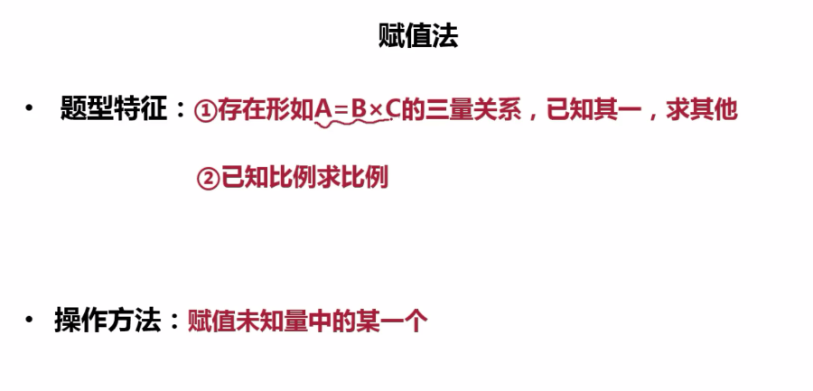

1. 代入排除

    

2. 数字特性

   - 奇偶特性

   题型：1. 知差求和（同性） 2. 2倍类、平均分 3.不定方程

   - 整除特性

   2（5）  末一位 2（5）

   4（25）  末两位4（25）

   8（125） 末三位8（125）

   3（9）    各位数字只和3（9）

   11倍数的特征**奇数位上的数字之和与偶数位上的数字之和的差（大减小）是十一的倍数** 

   - 倍数特性

     1. 普通倍数
     2. 因子倍数
     3. 比例倍数

     使用题型： 

     -  倍数
     -  百分数
     -  分数
     -  比例
     -  分组

   

    

   

3. 方程法

   

   

   

   

   

   

   题型：

   - 和差倍比
   - 鸡兔同笼
   - 盈亏问题
   - 经济利润
   - 行程问题

   原则

   1. 优先设所求量
   2. 设小不设大
   3. 设中间变量

4. 不定方程（组）

   限制性不定方程

   - 奇偶性
   - 因子倍数(**最大公约数**)
   - 尾数法（系数5，10...）
   - 赋0法 无穷解（多元 一般为3元）让一元为0

   

5. 赋值法

   

5. 线段法

   A+B=C

   一般是一次混合，多次混合可能方程更快

   
   
   
   
7. 工程问题

   工程总量=效率*时间

   

   

   

   

   

   题型：

   - 给定时间型   赋值总量为**时间公倍数**
   - 效率制约型  赋效率比值
     1. 甲：乙= a:b   甲赋a 乙赋b
     2. 效率变化
     3. 没特殊说明，忽略个体差异（效率相同）

6. 牛吃草

   

   

9. 行程问题

   

   基本公式  s=vt

   题型：

   相对速度

   1. 流水行船

   2. 相遇追及  

      s相=(v1+v2)t

      s追=（v1-v2)t

   3. 等距离平均速度

      v=2v1v2/(v1+v2)

   4. 环形跑道(相遇n次  s=n圈)

      -  反向相遇   S=(v1+v2)t
      -  同向套圈  S=(v1-v2)t

   5. 两端相遇

      第n次相遇 共走了（2n-1）S

   

   

10. 排列组合（计数问题）

   分类：加法

   分步：乘法

   

   排列：A(array) 交换顺序对结果有影响

   组合：c(combination) 交换顺序对结果无影响

   

   

   - 捆绑法-相邻问题

      

   - 插空法-不相邻问题

      

      **先排只看内部是否有顺序**

   - 插板法-至少有1个任务

     情况1-m>2:C(n-1,m-1)

     

     

     首先给每个下属分配2个任务  剩余20-3*2=14   C(13,2)=78

     情况2-m=2:C(n-1,1)

     情况3-m=1:C(n-1,1)+1

     

   - 错位排序

     D2=1 D3=2 D4=9 D5=44

     

8. 概率问题

   P=满足条件的情况数/总的情况数

   逆向计算型

   同组（元素依次选择）

   平均分组= 总可能性/A(组数，组数)

   

9. 经济利润问题

   基本经济利润：列表法(成本，售价，利润...)、方程法、赋值法（优先赋成本）

   分段计费：画图法、分段计算

   

   利润    率=利润/成本  

   

10. 数列

  

  偶数项 中项为中间两项平均值

  

14. 最值问题

   - 最不利构造：最不利值+1

   - 构造数列：排序-定位-构造-求和-反向取值（最少 向上 最多 向下）

      **注意有没有说量重复**

      能代入的直接代入次少和最少

   - 多集合反向构造

     多集合反向构造的题型就是问“……都……至少……”，比如“班上有20个人，打篮球的15个人，打乒乓球的12个人，踢足球的有14人，问这个班三个都玩至少有多少人?”，
     
     反向-求和-做差
     
     或者
     
     直接套公式

14. 容斥原理

    - 2集合容斥

      

      S(A,B)=A+B-A and B=总-都不

    - 三集合

      

      

      中心确定时：

      

      

      特殊情况，求集体至少
      
      
      
      
      
      

12. 经济利润

    

    

     

    

    分段计费模型
    
    
    
    最值问题
    
    
    
    
    
12. 几何问题

    ​    圆周长： 2piR  pi*d

    ​    球表面积=4piR^2 球体积  4/3piR^3

      假设长度一定，要求面积尽量大    圆->正n边形

    ​	a+b为定值  求ab最大   当a=b时

    同弧所对的圆周角等于它所对的圆心角的一半

30度  1：sqrt(3):2

正6变形 正8边形

等比放缩，若边长变成原来的n倍

- 对应角度不变
- 对应面积变成原来的n^2
- 对应体积变成原来的n^3

几何构造

  

13. 方阵公式

    1)方阵总数=最外层每边数目的平方;（**实心**）

    2)方阵最外一层总数比内一层总数多8(行数和列数分别大于2);

    3)方阵最外层每边数目=(方阵最外层总数÷4)+1;  最外层总人数=4（N-1）

    4)方阵最外层总数=[最外层每边数目-1]×4;

    5)去掉一行、一列的总数=去掉的每边数目×2-1。

    6)偶数型**实心**方阵的最外层每边人数=2×层数

14. 单边植树模型（含两端）  总长/间隔+1=需要种树的数量  总长=(棵树-1)*间隔

    环形型植树模型  总长/间隔=需要种树的数量

15. 钟表问题

    一格30°  分钟速度 6°/min  时钟速度0.5°/min

15. 时区问题 

    a比b晚了1h，则a=b-1

17. 称重问题，使用n次天平最多可以判定3^n个

17. 

