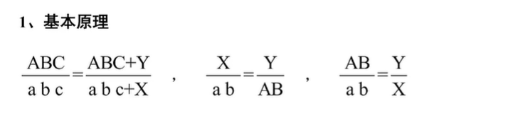

时间+主语+问题

现  基+数据+公式


- 单位问题

  计算题,同一个数量级的无需看单位和小数点

  

  1. 比较大小

  2. 综合分析
  3. 有效数字比较接近,量级不同

  以上需要看单位

  


## 高频术语详解

- 基期: 作为对比参照(参照物)放入时期称为基期

  现期:相对与基期的称为现期

  描述基期的具体数值的称为基期量

  描述现期的具体数值的称为现期量

- 同比: 与历史同期相比较

  环比:与紧紧相邻的统计周期相比较

  同比:基期的**第一个时间单位**向前递推一次,其余单位不变

  环比:基期的**最后一个时间单位**向前递推一次,其余单位不变

- 百分数: 两个数的比值,表示为n%

  百分点: 两个百分数的变化幅度,表示为n

- 增长量=现期量-基期量= 基期量\*增长率=现期量/(1+增长率)*增长率

  现期量=基期量*(1+增长率)

  基期量=现期量/1+增长率

  增长率=增长量/基期量=(现期量-基期量)/基期量=增长量/(现期量-增长量)

  增长率=增速~~增幅

  发展速度= 现期量/基期量=增长率+100%

  现期量**比**基期量增长几倍是**增长率**;现期量**是**基期量几倍是**发展速度**

- 比重指部分在总体中所占的百分比

  比重=部分/总体;总体=部分/比重 ;部分=总体*比重 

- 倍数 A/B

- 平均数

  年均,**月均, 日均** -> 总量/对应时间

- 平均增长量

  平均增长量=( 末期值-初期值)/间隔年份

- 平均增长速度

  末期值=初期值*(1+年均增长率)^n
  $$
  年均增长率=\sqrt[n]{\text{末期/初期}}-1
  $$
  当n和增长率较小时
  $$
  a\left( 1+x \right) ^n\approx a\left( 1+nx \right)
  $$

- 指数  **一般将基数设为100**

- 成数   表示 1/10   **近2成 不超过2成  约2成 可以超过2成**

- 翻一番为原来的2倍 翻n番为原来的2^n倍 

- 顺差:  一个国家(或地区)的**出口商品额大于进口商品额**

  逆差:  一个国家(或地区)的**出口商品额小于进口商品额**

- 第一产业: 农 林 牧 渔(不包含农 林 牧 渔服务业—第三产业)

  第二产业:  工业和建筑业

  第三产业:第一产业/第二产业外的其他行业

- GDP 国内生产总值 为三大产业的增加值之和

- 恩格尔系数: 家庭收入中(或总支出中)用来**购买食物的支出所占的比例**

- 基尼系数: 用以衡量一个[国家](https://baike.baidu.com/item/国家/17205?fromModule=lemma_inlink)或地区[居民收入](https://baike.baidu.com/item/居民收入/9877575?fromModule=lemma_inlink)[差距](https://baike.baidu.com/item/差距/1855729?fromModule=lemma_inlink),在全部[居民收入](https://baike.baidu.com/item/居民收入?fromModule=lemma_inlink)中，用于进行不平均分配的那部分收入所占的比例

- 五年计划

  

十一五规划  2006-2010年

- 产销比=销量/产量   衡量清库存能力
- **毛利率=（营业收入－营业成本 ）/营业收入**

**增长贡献率=部分增量/总体增量**

经济学结论：名义增长率大于实际增长率，说明居民消费价格（物价）上涨


## 快速计算实用技巧

1. 直除法

   - 数量级 **尤其是比较大小**

   - 除到有效数字能区分

2. 估算法

   选项差距大  两个接近选项在1.1倍以上

   - 四舍五入取2位

   - 就近取整保2位   方法1的补充  如30762->30

   - 同比例减误差：除法同大同下，乘法一大一小

   - 截位估算法

     对形如  (A1+A2+A3+.....)/(B1+B2+.....)
     分子/分母找到最大的数据，四舍五入取2位，对分子/分母的其他数据同时截断相同的位数并四舍五入

3. 特殊值法

   

4. 插值法（中间值法）

   计较两个数时(看选项在1.1以内),采取一个中间值(一般是1/n)参考对照

5. 公式法

   - 在|r|<5%时,基期=现期/(1+r)  画圈法 转化为基期=现期(1-r)

   - 间隔增长率(两时期)

     如果第二期和第 b三期增长率为r1 和 r2 则第三期相对第一期的增长率为  R=r1+r2+r1*r2

   

6. 分数比较

   - 分子,分母比较

   - 直除

   - 化同法(通分)

   - 差分法

     比较a/b  c/d  

     已知a>c  b>d

     1. 差分=(a-c)/(b-d)

     2. 比较c/d 与差分的关系
     3. 用a/b 替代差分得到结论

     

7. 速算尺（除法）

   - 标记大小数的位置
   - 如果分母是小数 那么1对应分母；否则10对应分母（整数部分为0）
   - 

8 . 基期比值1+a/1+b计算时 b不大时   除法转化成减法

## 高频考点详解


- **多段落**文字性材料

  标记每一个自然段 **第一个数据前面的关键字(不同)**,默认其是该 段落的主旨题 

- **单段落**文字性材料

  每一个分论点(句号和分号)第一个数据前面的关键字(不同)

- 表格

  **标题是表格材料的主旨概括,扼要说明统计表的中心内容(主语)**

- 图形

  **标题**

  **图例**

  注意: 黑白的饼形图一般都是12点钟顺时针依照图例/表格顺序标记


## 题型

1. 简单计算及直接读数

2. 增长率

   混合增长率: 当整体为a,部分为b 

   如b>a 则剩余部分<a; 反之 剩余部分>a

   任何形如a=b+c的都可考虑  如 出口=顺差+进口
   **混合增长率偏向基数大的**

3. 增长量

   柱状图/折线图 

   线段的倾斜角度越大,则增长量更大

   线段的倾斜角度越大且基期小,则增长率更大

    **现期量*增长率越大,增长量越大**

4. 比重

   部分的现期 A 增长率 a;

   整体的现期 B 增长率 b;

   部分整体基期比 A/B *(1+b)/(1+a)

   比重变化 A/B*(a-b)/(1+a) 一般1+a>0   也就是说a>b  则现期比重>基期比重

   ​		实际数据小于  |a-b|

5. 平均数与倍数

   平均值的增长率（比值增长率）  (a-b)/(1+b)  a是分子增速 b是分母增速

   比如 平均每个单位的从业人数比上年约   那么a为 从业人数增速  b为 单位增速	

6. 分析类问题

   - 运算陷阱 如加减运算
   - 时间陷阱
   - 单位陷阱 偶尔会出现货币单位 如人民币/美元
   - 概念陷阱
   - 范围陷阱


## 进阶

1. 列式

   列式只保留**三位计算**（除非选项有效数字在第三位有差距，且相差3以内,此时**四位**运算，可转成4位/2位），采用**只舍不入**

   加减运算部分，截位一致（去掉的位数一致） **最后结果一定比计算结果大**

2. 加法计算

   - 尾数法

     需要精确计算时（选项与材料数据精度、单位一致） 优先考虑尾数法

     所有选项**最后一位/两位**不同，计算最后一位/两位

   - 首数法

     先加最高位，再估算其他数位

     错位叠加（精度高，效率低）： 首位  次位分别叠加

   - 接近等差数列的数据，凑成**等差数列**计算（奇数项： 中间项*项数  偶数项： 中间项均值 * 项数） 然后计算剩余值

3. 减法计算

   - 分组直减（无需借位，分组计算）
   - 减整补余

4. 乘法速算

   错位相乘 2 * 1 /3 * 1/ 2 * 2

   三位*三位 （错位复杂太高）

5. 除法速算

   - 直除   选项差距大

   - 结果为1倍多，除法拆分（分子-分母）

   - **三个数以上的复合乘除法 先约明显约数**

     

     

6. 误差分析

   

7. **比例修正**

   

   注意： 太小的数如果往前添0估算误差就会很大，可以往后添0

   常见模型：

   

   ABC-X*A.B

   

   先化成ABC/111   然后ABC-AB计算

   

   **对abc,xyz进行加减上，以此消掉**

8. 量级分析

   一、先估算有效数字

   二、确定符号，在分析剩余数字量级	

9. 比较类题型

   一、 同数量级

   二、 三位原则 保持位数差相同

   三、 计算

   - 直除

   - 分数大小性质

   - 精确**比较**

     1. 分式大数字/小数字=1倍多时  分子分母做差 将得到的差值作为分子/分母重新估算新值大小

        A/B越大  A-B/B也越大； A/B越大  A/(B-A)也越大

     2. 分式大数字/小数字=2倍以上 

        - 差分法（**跟数值小的比较**）
        - 凑成1倍多 分母乘以相应倍数

10. 比较变化式子

   

   

   

11. ​     


比重变化A/B*(a-b)/(1+a)  **基期比重  A/B*(1+b)(1+a)**


## 特殊

``` 
a/1+x%   +-   b/1+y%

1. a>5b  化为    (a+b)/1+x%
2. 其他   根据分子确定分母 看选项差距 
```

```
a/1+b%*b%画圈代入法
1. 增长率b>0,在0-100
2. 增长选项差距小
(任一选项-a)*b%即为结果

先根据分数筛选（预估）
a减去尾数相同的选项（可在选项中间选一个数），然后*b 即是结果

```

