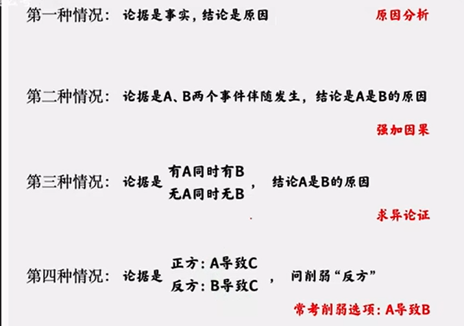
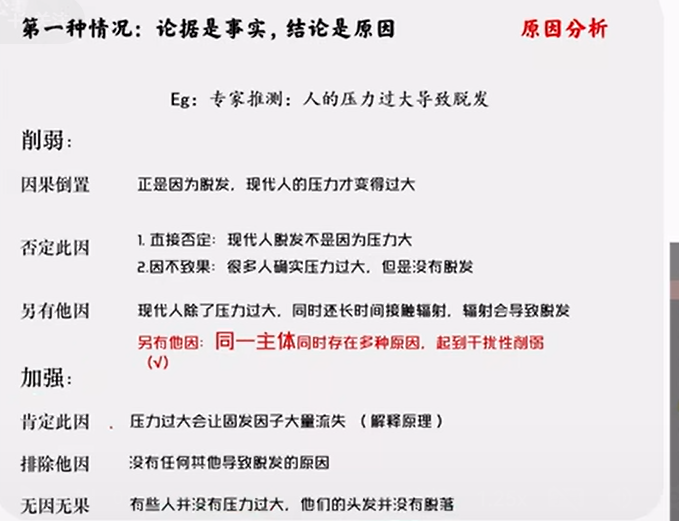
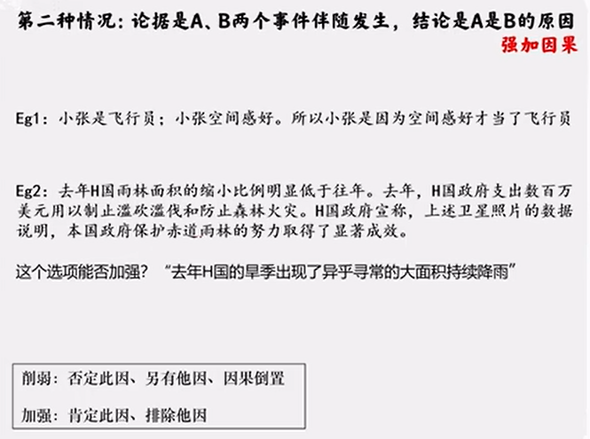
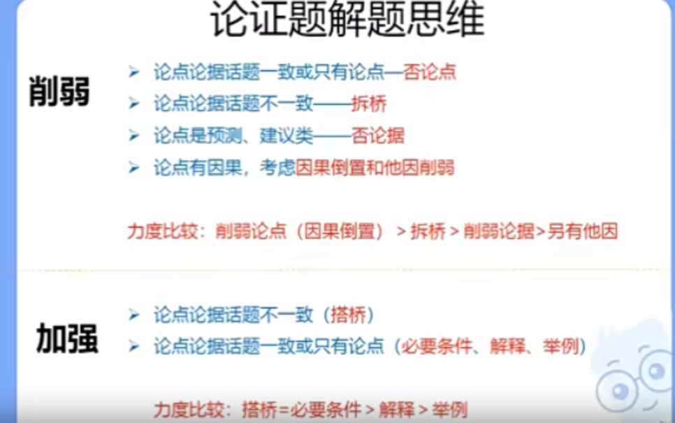

**先翻译后推理**

1. 如果....就..../凡是...都/....  X=>Y
2. 只有....才/除非....否则不/X是Y的关键,前提 /....  Y=>X

**否前/肯后不一定**

逆否关系 x=>y 等价于 !y=>!x

除非x否则y 随便否定一项,推出另一项

​          递推关系  X=>Y Y=>Z 等价于  X=>Z

1. 且

   **逻辑不讲感情色彩** 虽然...但是......也是并列条件

2. 或

3. !(A->B) 等价于  A&!B

A|B 的否定是  !A&!B

A&B的否定是 !A|!B

或关系的否一推一:  如果A|B为真  则**推出**!A->B  !B->A

有的A是B等价于有的B是A

### 推理方式

题目特征: 

- 下面哪项的推理形式与题干中的**推理形式\结构**相同

- 下列与题干所犯的**逻辑错误**相同的是

  重结构  轻内容 

### 削弱型

前提(论据)-论证过程>结论(论点)

先找结论 

**削弱类**

如果以下各项为真,最能质疑/反驳/削弱/反对上述论断/结论的是?

- 削弱 **论点 或 X->X(前后话题一致)**

  - 直接削弱  !x
  - 反例削弱  !x的例子

- 拆桥   X->Y

  - 前提 A->B

    结论A->C

    桥为B->C 

    B&!C 

  **去同存异**

  **否论点>拆桥>削论据(论点为预测类建议类,或争论时)**

### 因果分析

题型特征: **论点**包括因果关系

**必须是因果,而不是判断,条件语句(只有....才... 如果....就...)等**

**去同求异**

### 加强

题型特征

- 以下哪项为真,最能加强/支持/证明/赞同
- 以下哪项为真,是上述论证成立的**假设/前提/必要条件**

1. 搭桥

   同时包含论点和论据的**关键字**,**并肯定论点和论据之间的关系**  **去同存异**

2. 补充论据(**话题一致**)

   - 必要条件:选项为论点成立所必须的  前提/假设/必要条件

     **否定选项后论点仍可能成立为非必要条件**

   - 解释 说明论点成立的原因

   - 举例 说明论点成立的例子

   

### 组合排列

特征: 先给出一组对象,并给出对象所具有的若干信息,需要对各类信息做匹配

思路

1. 信息匹配 确定(....是....)+不确定(....不是....)
2. 涉及大小比较,极值是突破口
3. **重复次数最多**的信息是突破口

做题方法:

1. 排除

   **题干信息比较确定,选项比较全面**

2. 代入

   - 题干有真有假
   - 提问为"可能","不可能"

3. 符号或列表/数轴分析

4. 一真一假 最小信息法：找到最少提及的令其为真